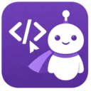

<p align="center">
  
</p>

<h1 align="center">Sidekick Agent Hub</h1>

<p align="center">
  <a href="https://open-vsx.org/extension/cesarandreslopez/sidekick-for-max"></a>
  <a href="https://open-vsx.org/extension/cesarandreslopez/sidekick-for-max"></a>
  <a href="https://marketplace.visualstudio.com/items?itemName=CesarAndresLopez.sidekick-for-max"></a>
  <a href="https://marketplace.visualstudio.com/items?itemName=CesarAndresLopez.sidekick-for-max"></a>
  <a href="https://www.npmjs.com/package/sidekick-agent-hub"></a>
  <a href="https://www.npmjs.com/package/sidekick-agent-hub"></a>
  <a href="LICENSE"></a>
  <a href="https://github.com/cesarandreslopez/sidekick-agent-hub/actions/workflows/ci.yml"></a>
  <a href="https://deepwiki.com/cesarandreslopez/sidekick-agent-hub"></a>
</p>

<p align="center">
  AI coding assistant with real-time agent monitoring — VS Code extension and terminal dashboard.
</p>

AI coding agents are powerful but opaque — tokens burn silently, context fills up without warning, and everything is lost when a session ends. Sidekick gives you visibility into what your agent is doing, AI features that eliminate mechanical coding work, and session intelligence that preserves context across sessions. Works with **Claude Max**, **Claude API**, **OpenCode**, or **Codex CLI**.

## What's New

- **z.ai Coding Plan quota (estimated)** — when OpenCode routes to a z.ai Coding Plan (GLM), Sidekick shows an *estimated* 5-Hour / Weekly quota derived from observed traffic (z.ai exposes no usage API). It's an estimate, observed-only, and not yet a selectable inference provider — see [limitations](docs/providers/opencode.md#limitations).
- **Claude Opus 4.8 & Fable 5** — recognized everywhere models are interpreted, with 1M-token context windows, accurate pricing, and "Fable" display labels.
- **Richer conversation view** — assistant reasoning, tool calls, and narration now interleave in arrival order (a compact Process + Answer shape) across Claude, Codex, and OpenCode sessions.
- **Session asset extraction** — pull URLs, file paths, commands, and plans out of recent chats with `sidekick extract` or the `Sidekick: Extract Session Assets` command.
- **Quota-history heatmap** — `sidekick quota history` renders a 13-week, per-workspace, GitHub-style view of session-limit utilization.
- **Multi-account management** — save, switch, and remove Claude Code and Codex accounts without manual login/logout cycles.
- **Always-current pricing** — model prices hydrate from the LiteLLM catalog on startup, and `sidekick-shared` is published to npm for building your own tools.

See the [full changelog](CHANGELOG.md) for everything.

## Two Ways to Use Sidekick

### VS Code Extension

Inline completions, code transforms, commit messages, session monitoring, session asset extraction, and more — all inside VS Code.

<p align="center">
  
</p>

Install from the [VS Code Marketplace](https://marketplace.visualstudio.com/items?itemName=CesarAndresLopez.sidekick-for-max) or [Open VSX](https://open-vsx.org/extension/cesarandreslopez/sidekick-for-max). See the [full feature list](https://cesarandreslopez.github.io/sidekick-agent-hub/features/inline-completions/) in the docs.

### Terminal Dashboard (CLI)

Full-screen TUI for monitoring agent sessions — standalone, no VS Code required.

> **Note:** The npm package is `sidekick-agent-hub`, but the binary is called **`sidekick`**.

```bash
npm install -g sidekick-agent-hub    # requires Node.js 20+
sidekick dashboard
```

<p align="center">
  
</p>

Browse sessions, tasks, decisions, knowledge notes, charts, and live event streams. Auto-detects your project and session provider. See the [CLI Dashboard docs](https://cesarandreslopez.github.io/sidekick-agent-hub/features/cli/) for keybindings and full usage.

Eight panels: Sessions, Tasks, Kanban, Notes, Decisions, Plans, Events, and Charts. The Events panel streams live session activity with colored type badges. The Charts panel shows tool frequency bars, event distribution, a 60-minute activity heatmap, and pattern analysis. Press `/` to filter with substring, fuzzy, regex, or date modes.

Standalone commands jump directly to a specific panel or run one-shot queries, including extracting actionable links, files, commands, and plans from recent Claude Code and Codex chats. VS Code users can run `Sidekick: Extract Session Assets` for the same asset model in a native QuickPick.

```bash
sidekick tasks                                      # open tasks panel
sidekick search "migration"                         # cross-session search
sidekick stats                                      # session statistics
sidekick extract                                    # URLs, files, commands, plans from recent chats
sidekick extract --type url,path --limit 10 --json  # script-friendly filtered extraction
sidekick quota                                      # quota / rate-limit check
sidekick quota history                              # 13-week quota-utilization heatmap (per workspace)
sidekick status                                     # API status check (Claude + OpenAI)
sidekick peak                                       # Claude peak-hours check (faster session-limit drain)
sidekick dump --format markdown > session-report.md
sidekick report                                     # HTML report → browser
```

Also available: `sidekick decisions`, `sidekick notes`, `sidekick handoff`, `sidekick context`, `sidekick quota`, `sidekick status`, `sidekick peak`, `sidekick account`.

### Account Management

On first run, Sidekick auto-registers your active system Claude Code and Codex credentials as a **"Default"** account — no setup required. Use the flags below only when you want to add a second account or switch between them.

Manage multiple accounts for Claude Code and Codex — save, switch, and remove without manual login/logout cycles:

```bash
sidekick account                                    # list saved accounts
sidekick account --provider all                     # list Claude + Codex accounts together
sidekick account --add --label Work                 # save the current Claude Code account
sidekick account --login --label Personal           # sign in and save a NEW account (isolated flow)
sidekick account --switch                           # switch to next account
sidekick account --switch-to personal@gmail.com     # switch to a specific account
sidekick account --remove old@example.com           # remove a saved account
sidekick account --auto-switch 90                   # auto-switch when quota crosses 90% (off to disable)
sidekick account --launcher work                    # create a per-account terminal launcher

# Codex profiles
sidekick account --provider codex                   # list Codex accounts
sidekick account --provider codex --add --label Dev # add a Codex profile (opens login)
sidekick account --provider codex --switch-to Dev   # switch by label, email, or ID

# Combined quota view
sidekick quota --all                                # Claude + Codex quota side by side
```

In VS Code, account actions are available from the status bar menu and the Command Palette — sign in to a new account, switch across all saved Claude Code and Codex accounts from one picker, and opt into quota-based auto-switching via the `sidekick.accounts.autoSwitchThreshold` setting. See the [Claude Max](https://cesarandreslopez.github.io/sidekick-agent-hub/providers/claude-max/) and [Codex](https://cesarandreslopez.github.io/sidekick-agent-hub/providers/codex/) provider docs for setup guides.

## Provider Support

| Provider | Inference | Session Monitoring | Cost |
|----------|-----------|-------------------|------|
| **[Claude Max](https://cesarandreslopez.github.io/sidekick-agent-hub/providers/claude-max/)** | Yes | Yes | Included in subscription |
| **[Claude API](https://cesarandreslopez.github.io/sidekick-agent-hub/providers/claude-api/)** | Yes | — | Per-token billing |
| **[OpenCode](https://cesarandreslopez.github.io/sidekick-agent-hub/providers/opencode/)** | Yes | Yes | Depends on provider |
| **[Codex CLI](https://cesarandreslopez.github.io/sidekick-agent-hub/providers/codex/)** | Yes | Yes | OpenAI API billing |

> **OpenCode note:** DB-backed OpenCode session monitoring reads `opencode.db` and currently expects an executable `sqlite3` runtime in the host environment.

## Why Am I Building This?

AI coding agents are the most transformative tools I've used in my career. They can scaffold entire features, debug problems across files, and handle the mechanical parts of software engineering that used to eat hours of every day.

But they're also opaque. Tokens burn in the background with no visibility. Context fills up silently until your agent starts forgetting things. And when a session ends, everything it learned — your architecture, your conventions, the decisions you made together — is just gone. The next session starts from zero.

That bothers me. I want to see what my agent is doing. I want to review every tool call, understand where my tokens went, and carry context forward instead of losing it. Sidekick exists because I think the people using these agents deserve visibility into how they work — not just the output, but the process.

## Documentation

Full documentation is available at the [docs site](https://cesarandreslopez.github.io/sidekick-agent-hub/), including:

- [Getting Started](https://cesarandreslopez.github.io/sidekick-agent-hub/getting-started/installation/)
- [Provider Setup](https://cesarandreslopez.github.io/sidekick-agent-hub/getting-started/provider-setup/)
- [CLI Dashboard](https://cesarandreslopez.github.io/sidekick-agent-hub/features/cli/)
- [Feature Guide](https://cesarandreslopez.github.io/sidekick-agent-hub/features/inline-completions/)
- [Configuration Reference](https://cesarandreslopez.github.io/sidekick-agent-hub/configuration/settings/)
- [Architecture](https://cesarandreslopez.github.io/sidekick-agent-hub/architecture/overview/)
- [Why Am I Building This?](https://cesarandreslopez.github.io/sidekick-agent-hub/#why-am-i-building-this)

## Contributing

Contributions are welcome! See [CONTRIBUTING.md](CONTRIBUTING.md) for setup instructions and guidelines.

## See Also

**[sidekick-shared](https://www.npmjs.com/package/sidekick-shared)** — the shared data access library, published as a standalone npm package. Types, parsers, session providers, event aggregation, model pricing, Zod schemas, actionable session-asset extraction, and more — for building your own tools on top of Sidekick session data without depending on the VS Code extension or CLI. Install with `npm install sidekick-shared`.

**[Sidekick Docker](https://github.com/cesarandreslopez/sidekick-docker)** — a sibling project that brings the same real-time dashboard experience to Docker management. Monitor containers, Compose projects, images, volumes, and networks from a keyboard-driven TUI or VS Code panel. Available as a [VS Code extension](https://marketplace.visualstudio.com/items?itemName=CesarAndresLopez.sidekick-docker-vscode), [Open VSX extension](https://open-vsx.org/extension/CesarAndresLopez/sidekick-docker-vscode), and [CLI](https://www.npmjs.com/package/sidekick-docker).

## Community

If Sidekick is useful to you, a [star on GitHub](https://github.com/cesarandreslopez/sidekick-agent-hub) helps others find it.

Found a bug or have a feature idea? [Open an issue](https://github.com/cesarandreslopez/sidekick-agent-hub/issues) — all feedback is welcome.

## Acknowledgements

The **session asset extraction** feature — the `Sidekick: Extract Session Assets` VS Code command and the `sidekick extract` CLI command — was contributed by **[Juan Fourie (@B33pBeeps)](https://github.com/B33pBeeps)** in [#17](https://github.com/cesarandreslopez/sidekick-agent-hub/pull/17), adapted from his MIT-licensed [`trawl`](https://github.com/B33pBeeps/trawl) project. Thank you, Juan! See [CONTRIBUTORS.md](CONTRIBUTORS.md) and [THIRD_PARTY_NOTICES.md](THIRD_PARTY_NOTICES.md) for details.

## License

MIT — see [LICENSE](LICENSE). Portions of the session asset extraction feature are adapted from the MIT-licensed [`trawl`](https://github.com/B33pBeeps/trawl); see [THIRD_PARTY_NOTICES.md](THIRD_PARTY_NOTICES.md).
