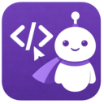

<p align="center">
  
</p>

<h1 align="center">Sidekick Agent Hub</h1>

<p align="center">
  <a href="https://open-vsx.org/extension/cesarandreslopez/sidekick-for-max"></a>
  <a href="https://open-vsx.org/extension/cesarandreslopez/sidekick-for-max"></a>
  <a href="https://marketplace.visualstudio.com/items?itemName=CesarAndresLopez.sidekick-for-max"></a>
  <a href="https://marketplace.visualstudio.com/items?itemName=CesarAndresLopez.sidekick-for-max"></a>
  <a href="https://www.npmjs.com/package/sidekick-agent-hub"></a>
  <a href="https://www.npmjs.com/package/sidekick-agent-hub"></a>
  <a href="LICENSE"></a>
  <a href="https://github.com/cesarandreslopez/sidekick-agent-hub/actions/workflows/ci.yml"></a>
  <a href="https://deepwiki.com/cesarandreslopez/sidekick-agent-hub"></a>
</p>

<p align="center">
  AI coding assistant with real-time agent monitoring — VS Code extension and terminal dashboard.
</p>

AI coding agents are powerful but opaque — tokens burn silently, context fills up without warning, and everything is lost when a session ends. Sidekick gives you visibility into what your agent is doing, AI features that eliminate mechanical coding work, and session intelligence that preserves context across sessions. Works with **Claude Max**, **Claude API**, **OpenCode**, or **Codex CLI**.

## What's New

- **0.26.6: verified account switching** — Sidekick registers the Claude Code and Codex logins you already use under their email, keeps saved profiles fresh as tokens rotate, and switches in two verified phases with an undo. Expiring and expired credentials are flagged before they fail, switches to dead credentials are refused, and running apps that still hold the previous login are named per app (the Claude Desktop app is out of reach). New `sidekick accounts` picker and subcommands (`list`, `add`, `switch`, `login`, `remove`, `shell`, `env`, `undo`, `doctor`, `config`), a dashboard accounts overlay, and a VS Code Accounts view with a health-coloured status bar badge, one switch notification with Undo, and **Open Terminal as Account** for two accounts side by side.
- **0.26.5: cheaper session watching and a calibrated token alert** — observed-session watching reconciles each file event with one stat and re-walks session directories only for unknown paths, catch-up polls, and the initial pass, with bounded discovery and parse-cache limits for hosts over large histories. The VS Code high-token-usage warning fires once per session (default 5,000,000 cache-inclusive tokens), then at most every 30 minutes.
- **0.26.4: sharper authentication and policy guidance** — inference failures that say a login expired or ask to re-authenticate get credential-aware recovery hints, a rejected refresh token is reported as sign-in required even when the message also mentions an expired conversation, and `Permission denied by policy` (including HTTP 403) points to execution permissions.
- **0.26.3: provider failure diagnosis and status evidence** — `sidekick-shared` adds `diagnoseProviderFailure()` (pure, browser-safe) and `fetchProviderServiceStatus()` (explicit observed/unavailable evidence). The extension and CLI use them so inference failures name the actual problem with a recovery hint, connection tests separate local readiness from authenticated requests, and `sidekick status`, the dashboards, and Doctor show unavailable or partial public status instead of implying normal operation.
- **0.26.2: monitoring recovery, replay, and search** — stop/resume keeps dashboard subscriptions and custom session folders; cancelled inline requests stop inference. Empty dashboards offer recovery actions, and tabs and session cards support keyboard navigation. Complete-line checkpoints preserve Unicode and parser context; live-only CLI runs keep complete-history caches intact. Project search includes database-only OpenCode sessions, and Doctor focuses on the selected provider.
- **Usage straight from session logs** — `sidekick daily`, `weekly`, `monthly`, and `sessions` report tokens and cost for every provider without the extension's history store; `sidekick blocks` shows five-hour billing blocks with burn rate and end-of-block projections; `sidekick import` backfills the history store behind `stats`, `today`, and the History tab.
- **One token vocabulary with cost provenance** — every total across the CLI, the extension, and reports counts input, output, and both cache buckets, and every cost says whether it was provider-reported or estimated from catalog pricing.
- **Official quota from the status line** — `sidekick statusline` reads the JSON Claude Code pipes to it and persists the official five-hour and seven-day limits; `resolveQuota()` gives `sidekick quota`, the MCP server, and both dashboards one resolver (fresh sample → session logs → provider API for Claude and z.ai; API first for one-shot Codex queries), and every quota table names its source and age.
- **`state.json` for external tools** — a public, versioned snapshot of the active account, quota windows with freshness, context usage, session cost, and the active billing block, written by the status line and both dashboards for tmux bars, menu-bar apps, and scripts.
- **Deeper dashboard** — the VS Code History tab gains hourly today, by-model and by-tool series, a project filter, and a previous-period overlay; a new Health tab shows doctor checks, provider diagnostics, and failing-tool trends; quota threshold alerts fire once per reset window; a Billing block card sits beneath the quota gauges.
- **Faster hosts** — observed sessions are parsed once and re-read only when they change, Codex discovery uses one capped walker, extension activation defers account seeding and git initialisation, and dashboard messages are coalesced.
- **Host-safe shared APIs** — `sidekick-shared` 0.25.0 adds async session previews, push-based collector/monitor/account subscriptions, an I/O-free provider factory with structured diagnostics (missing `sqlite3` is now a diagnostic, not an empty result), `findSessionById()`, and cross-realm model-catalog transfer with registerable aliases — built for long-lived embedders like desktop apps and extension hosts.
- **Prompt history** — `sidekick history` lists your most recent Codex prompts across every workspace, and `--path` jumps straight to a session's transcript file. `sidekick dump --list` and the session picker now read a cheap preview index with a `--limit` bound, so huge session directories stay fast.
- **Non-blocking account operations** — Codex login probes, account switches, and login polling run off the event loop, so the VS Code extension host and other embedders no longer freeze during account operations. Store writes from the extension and CLI are serialized through locked atomic writers.
- **Fast daily workflow** — `sidekick statusline`, `today`, `doctor`, atomic terminal capture, and generic external handoff keep common checks and updates one command away.
- **Guided VS Code onboarding** — a five-step first-run walkthrough (detect a session, open the dashboard, read the status bar, add your accounts, capture a note) plus a `Sidekick: Show Menu` command hub generated from the extension manifest.
- **Read-only MCP facts** — register `sidekick mcp` with Claude Code or Codex so the running agent can inspect quota, burn rate, context pressure, and project stores.
- **Shared analytics and observed-session V1** — categorized failure history, beta quality trends, code-impact and compaction ledgers, plus versioned provider-neutral contracts for downstream tools.
- **Codex reset credits** — `sidekick quota` (which always queries the Codex API) and the VS Code dashboard "Rate Limits" tile surface available rate-limit reset credits and their expirations.
- **z.ai Coding Plan quota** — when OpenCode routes to a z.ai Coding Plan (GLM), Sidekick shows authoritative 5-Hour / Weekly quota read from z.ai's quota API (with cached-snapshot fallback). z.ai is monitored-only and not yet a selectable inference provider — see [limitations](docs/providers/opencode.md#limitations).
- **Claude Opus 5, Sonnet 5, Fable 5 & Fable 5.1** — recognized everywhere models are interpreted, with 1M-token context windows, accurate pricing (including Fable 5.1's lower cache-read rate and GPT-6 Astra), and "Fable" display labels. Opus 5 and Sonnet 5 are the `powerful` and `balanced` tier defaults; Codex tiers map to GPT-5.6 Luna, Terra, and Sol.
- **Richer conversation view** — assistant reasoning, tool calls, and narration now interleave in arrival order (a compact Process + Answer shape) across Claude, Codex, and OpenCode sessions.
- **Session asset extraction** — pull URLs, file paths, commands, and plans out of recent chats with `sidekick extract` or the `Sidekick: Extract Session Assets` command.
- **Quota-history heatmap** — `sidekick quota history` renders a 13-week, per-workspace, GitHub-style view of session-limit utilization.
- **Always-current pricing and context sizes** — model prices and context window sizes hydrate from the LiteLLM catalog on startup, so new models are costed and gauged correctly without an update. `sidekick-shared` is published to npm for building your own tools.

See the [full changelog](CHANGELOG.md) for everything.

## Two Ways to Use Sidekick

### VS Code Extension

Inline completions, code transforms, commit messages, session monitoring, session asset extraction, and more — all inside VS Code.

<p align="center">
  
</p>

Install from the [VS Code Marketplace](https://marketplace.visualstudio.com/items?itemName=CesarAndresLopez.sidekick-for-max) or [Open VSX](https://open-vsx.org/extension/cesarandreslopez/sidekick-for-max). See the [feature highlights](https://cesarandreslopez.github.io/sidekick-agent-hub/#feature-highlights) in the docs.

### Terminal Dashboard (CLI)

Full-screen TUI for monitoring agent sessions — standalone, no VS Code required.

> **Note:** The npm package is `sidekick-agent-hub`, but the binary is called **`sidekick`**.

```bash
npm install -g sidekick-agent-hub    # requires Node.js 20+
sidekick dashboard
```

<p align="center">
  
</p>

Browse sessions, tasks, decisions, knowledge notes, charts, and live event streams. Auto-detects your project and session provider. See the [CLI Dashboard docs](https://cesarandreslopez.github.io/sidekick-agent-hub/features/cli/) for keybindings and full usage.

Eight panels: Sessions, Tasks, Kanban, Notes, Decisions, Plans, Events, and Charts. The Events panel streams live session activity with colored type badges. The Charts panel shows tool frequency bars, event distribution, a 60-minute activity heatmap, and pattern analysis. Press `/` to filter with substring, fuzzy, regex, or date modes.

Standalone commands jump directly to a specific panel or run one-shot queries, including extracting actionable links, files, commands, and plans from recent Claude Code and Codex chats. VS Code users can run `Sidekick: Extract Session Assets` for the same asset model in a native QuickPick.

```bash
sidekick tasks                                      # open tasks panel
sidekick search "migration"                         # cross-session search
sidekick stats                                      # session statistics
sidekick today                                      # cache-only daily brief
sidekick daily                                      # usage from session logs (also weekly, monthly, sessions)
sidekick blocks                                     # five-hour billing blocks with burn rate and projections
sidekick import                                     # backfill the history store from session logs
sidekick doctor                                     # installation/session diagnostics
sidekick statusline                                 # one-line agent footer
sidekick extract                                    # URLs, files, commands, plans from recent chats
sidekick extract --type url,path --limit 10 --json  # script-friendly filtered extraction
sidekick history                                    # recent Codex prompts across workspaces
sidekick quota                                      # quota / rate-limit check
sidekick quota history                              # 13-week quota-utilization heatmap (per workspace)
sidekick status                                     # API status check (Claude + OpenAI)
sidekick peak                                       # Claude peak-hours check (faster session-limit drain)
sidekick dump --format markdown > session-report.md
sidekick report                                     # HTML report → browser
sidekick mcp                                        # read-only facts server for Claude Code/Codex
```

Also available: `sidekick decisions`, `sidekick notes`, `sidekick handoff` (and `handoff open`), `sidekick context`, plus the capture commands `tasks add` / `tasks done`, `note add`, and `decision add`.

### Account Management

Sidekick registers the Claude Code and Codex logins you already use, and lets you keep several on one machine — switch, sign in to another in an isolated profile, or run two side by side — without `/logout` cycles:

```bash
sidekick accounts                                   # interactive picker (Enter switch, a add, s shell, u undo)
sidekick accounts list                              # saved accounts with credential health
sidekick accounts add --label Work                  # sign in to a second account; current login untouched
sidekick accounts switch work                       # switch by label, email, or id (verified, undoable)
eval "$(sidekick accounts env work)"                # this shell only: claude/codex use Work
sidekick accounts shell work -- claude              # one claude session as Work
sidekick accounts doctor                            # expiry, running apps, Codex keyring mode
sidekick accounts config auto-switch 90             # auto-switch when quota crosses 90% (off to disable)

# Combined quota view
sidekick quota --all                                # Claude + Codex quota side by side
```

In VS Code, the **Accounts** view in the Agent Hub sidebar and the status bar badge show every saved account with its health; switch, sign in again, open a terminal as an account, or undo from there. Switching reaches new `claude` and `codex` CLI sessions, their IDE extensions after a reload, and the Codex desktop app after a restart; it does not reach the Claude Desktop app, which keeps its own session — Sidekick warns about each case. See the [Account Switcher](https://cesarandreslopez.github.io/sidekick-agent-hub/features/account-switcher/) guide.

## Provider Support

| Provider                                                                                      | Inference | Session Monitoring | Cost                     |
| --------------------------------------------------------------------------------------------- | --------- | ------------------ | ------------------------ |
| **[Claude Max](https://cesarandreslopez.github.io/sidekick-agent-hub/providers/claude-max/)** | Yes       | Yes                | Included in subscription |
| **[Claude API](https://cesarandreslopez.github.io/sidekick-agent-hub/providers/claude-api/)** | Yes       | —                  | Per-token billing        |
| **[OpenCode](https://cesarandreslopez.github.io/sidekick-agent-hub/providers/opencode/)**     | Yes       | Yes                | Depends on provider      |
| **[Codex CLI](https://cesarandreslopez.github.io/sidekick-agent-hub/providers/codex/)**       | Yes       | Yes                | OpenAI API billing       |

> **OpenCode note:** DB-backed OpenCode session monitoring reads `opencode.db` and currently expects an executable `sqlite3` runtime in the host environment.

## Why Am I Building This?

AI coding agents are the most transformative tools I've used in my career. They can scaffold entire features, debug problems across files, and handle the mechanical parts of software engineering that used to eat hours of every day.

But they're also opaque. Tokens burn in the background with no visibility. Context fills up silently until your agent starts forgetting things. And when a session ends, everything it learned — your architecture, your conventions, the decisions you made together — is just gone. The next session starts from zero.

That bothers me. I want to see what my agent is doing. I want to review every tool call, understand where my tokens went, and carry context forward instead of losing it. Sidekick exists because I think the people using these agents deserve visibility into how they work — not just the output, but the process.

## Documentation

Full documentation is available at the [docs site](https://cesarandreslopez.github.io/sidekick-agent-hub/), including:

- [Getting Started](https://cesarandreslopez.github.io/sidekick-agent-hub/getting-started/installation/)
- [Provider Setup](https://cesarandreslopez.github.io/sidekick-agent-hub/getting-started/provider-setup/)
- [CLI Dashboard](https://cesarandreslopez.github.io/sidekick-agent-hub/features/cli/)
- [Feature Highlights](https://cesarandreslopez.github.io/sidekick-agent-hub/#feature-highlights)
- [Configuration Reference](https://cesarandreslopez.github.io/sidekick-agent-hub/configuration/settings/)
- [Architecture](https://cesarandreslopez.github.io/sidekick-agent-hub/architecture/overview/)
- [Why Am I Building This?](https://cesarandreslopez.github.io/sidekick-agent-hub/#why-am-i-building-this)

## Contributing

Contributions are welcome! See [CONTRIBUTING.md](CONTRIBUTING.md) for setup instructions and guidelines.

## See Also

**[sidekick-shared](https://www.npmjs.com/package/sidekick-shared)** — the shared data access library, published as a standalone npm package. Types, parsers, session providers, event aggregation, model pricing, Zod schemas, actionable session-asset extraction, and more — for building your own tools on top of Sidekick session data without depending on the VS Code extension or CLI. Install with `npm install sidekick-shared`.

**[Sidekick Docker](https://github.com/cesarandreslopez/sidekick-docker)** — a sibling project that brings the same real-time dashboard experience to Docker management. Monitor containers, Compose projects, images, volumes, and networks from a keyboard-driven TUI or VS Code panel. Available as a [VS Code extension](https://marketplace.visualstudio.com/items?itemName=CesarAndresLopez.sidekick-docker-vscode), [Open VSX extension](https://open-vsx.org/extension/CesarAndresLopez/sidekick-docker-vscode), and [CLI](https://www.npmjs.com/package/sidekick-docker).

## Community

If Sidekick is useful to you, a [star on GitHub](https://github.com/cesarandreslopez/sidekick-agent-hub) helps others find it.

Found a bug or have a feature idea? [Open an issue](https://github.com/cesarandreslopez/sidekick-agent-hub/issues) — all feedback is welcome.

## Acknowledgements

The **session asset extraction** feature — the `Sidekick: Extract Session Assets` VS Code command and the `sidekick extract` CLI command — was contributed by **[Juan Fourie (@B33pBeeps)](https://github.com/B33pBeeps)** in [#17](https://github.com/cesarandreslopez/sidekick-agent-hub/pull/17), adapted from his MIT-licensed [`trawl`](https://github.com/B33pBeeps/trawl) project. Thank you, Juan! See [CONTRIBUTORS.md](CONTRIBUTORS.md) and [THIRD_PARTY_NOTICES.md](THIRD_PARTY_NOTICES.md) for details.

## License

MIT — see [LICENSE](LICENSE). Portions of the session asset extraction feature are adapted from the MIT-licensed [`trawl`](https://github.com/B33pBeeps/trawl); see [THIRD_PARTY_NOTICES.md](THIRD_PARTY_NOTICES.md).
