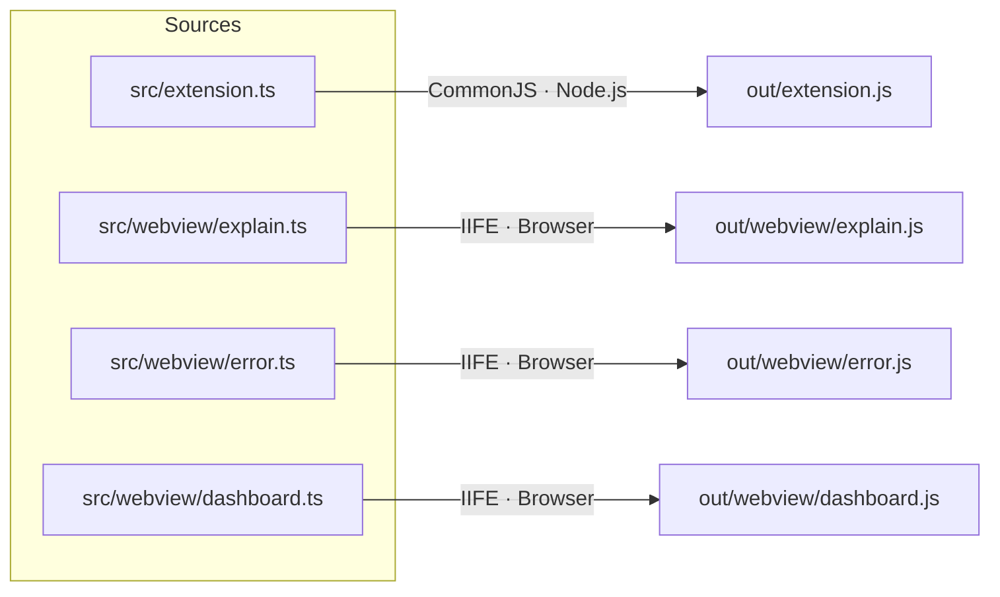
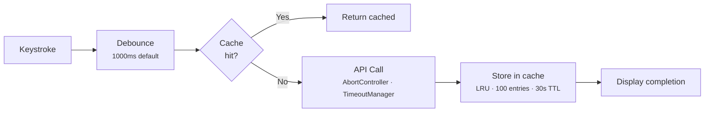

# Architecture Overview

## Build System (esbuild)

esbuild produces four bundles:

Only `vscode` is externalized. All other dependencies (including `@anthropic-ai/claude-agent-sdk` and `@opencode-ai/sdk`) are bundled by esbuild.

## Entry Point

`src/extension.ts` contains the `activate()` function which registers all commands, providers, and services.

## Key Source Locations

| Area | Location |
|------|----------|
| Entry point | `src/extension.ts` |
| Core types | `src/types.ts`, `src/types/` |
| Prompt templates | `src/utils/prompts.ts`, `src/utils/analysisPrompts.ts` |
| Inference clients | `src/services/AuthService.ts`, `MaxSubscriptionClient.ts`, `ApiKeyClient.ts`, `OpenCodeClient.ts`, `CodexClient.ts` |
| Session providers | `src/services/providers/ClaudeCodeSessionProvider.ts`, `OpenCodeSessionProvider.ts`, `CodexSessionProvider.ts` |
| Webview UI | `src/webview/` (vanilla TS, bundled as IIFE) |

## Request Management

- **Debouncing**: Configurable delay (default 1000ms) before firing inline completion requests
- **LRU cache**: `CompletionCache` — 100 entries, 30s TTL
- **Cancellation**: `AbortController` linked through `CompletionOptions.signal`
- **Timeouts**: `TimeoutManager` provides per-operation timeouts with context-size scaling

## Persistence

Cross-session data stored in `~/.config/sidekick/`:

| File | Purpose |
|------|---------|
| `historical-data.json` | Token/cost/tool usage stats |
| `tasks/{projectSlug}.json` | Kanban board carry-over |
| `decisions/{projectSlug}.json` | Decision log |
| `handoffs/` | Session handoff documents |
| `event-logs/` | Optional JSONL audit trail |
