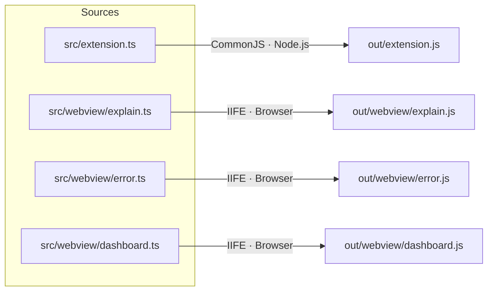
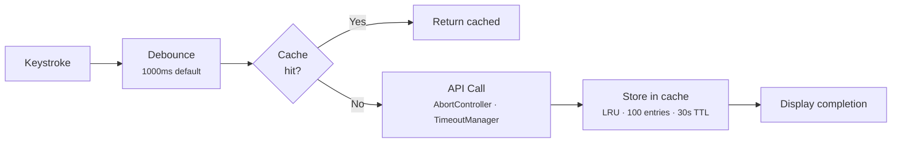

# Architecture Overview

## Build System (esbuild)

esbuild produces four bundles:

```mermaid
flowchart LR
    subgraph Sources
        EXT["src/extension.ts"]
        EXP["src/webview/explain.ts"]
        ERR["src/webview/error.ts"]
        DSH["src/webview/dashboard.ts"]
    end

    EXT -->|CommonJS · Node.js| O1["out/extension.js"]
    EXP -->|IIFE · Browser| O2["out/webview/explain.js"]
    ERR -->|IIFE · Browser| O3["out/webview/error.js"]
    DSH -->|IIFE · Browser| O4["out/webview/dashboard.js"]
```

Only `vscode` is externalized. All other dependencies (including `@anthropic-ai/claude-agent-sdk` and `@opencode-ai/sdk`) are bundled by esbuild.

## Entry Point

`src/extension.ts` contains the `activate()` function which registers all commands, providers, and services.

## Package Structure

| Package | Purpose | Build |
|---------|---------|-------|
| `sidekick-vscode/` | VS Code extension (UI, monitoring, inference) | esbuild |
| `sidekick-shared/` | Pure TS library — readers, types, session providers, schemas, extractors, model pricing, quota polling (no VS Code deps) | tsc |
| `sidekick-cli/` | CLI binary — 8 subcommands, markdown/JSON output | esbuild |

[`sidekick-shared`](https://www.npmjs.com/package/sidekick-shared) extracts the data access layer from the extension so it can be consumed by the CLI, third-party tools, and custom integrations. It is published as a standalone npm package (`npm install sidekick-shared`) with no VS Code dependencies. Key modules include Zod schemas for runtime JSONL validation, pure extractors (`extractTokenUsage`, `extractToolCalls`), model info and pricing (`getModelInfo`, `calculateCost`, `formatCost`), a typed `JsonlParser` with optional schema validation, and a `QuotaPoller` class with exponential backoff.

## Key Source Locations

| Area | Location |
|------|----------|
| Entry point | `src/extension.ts` |
| Core types | `src/types.ts`, `src/types/` |
| Prompt templates | `src/utils/prompts.ts`, `src/utils/analysisPrompts.ts` |
| Inference clients | `src/services/AuthService.ts`, `MaxSubscriptionClient.ts`, `ApiKeyClient.ts`, `OpenCodeClient.ts`, `CodexClient.ts` |
| Session providers | `src/services/providers/ClaudeCodeSessionProvider.ts`, `OpenCodeSessionProvider.ts`, `CodexSessionProvider.ts` |
| Webview UI | `src/webview/` (vanilla TS, bundled as IIFE) |
| Session analysis | `src/services/SessionAnalyzer.ts`, `src/utils/cycleDetector.ts` |

## Request Management

```mermaid
flowchart LR
    K["Keystroke"] --> D["Debounce<br/><small>1000ms default</small>"]
    D --> CC{"Cache\nhit?"}
    CC -->|Yes| R["Return cached"]
    CC -->|No| API["API Call<br/><small>AbortController · TimeoutManager</small>"]
    API --> CS["Store in cache<br/><small>LRU · 100 entries · 30s TTL</small>"]
    CS --> DI["Display completion"]
```

- **Debouncing**: Configurable delay (default 1000ms) before firing inline completion requests
- **LRU cache**: `CompletionCache` — 100 entries, 30s TTL
- **Cancellation**: `AbortController` linked through `CompletionOptions.signal`
- **Timeouts**: `TimeoutManager` provides per-operation timeouts with context-size scaling

## Persistence

Cross-session data stored in `~/.config/sidekick/`:

| File | Purpose |
|------|---------|
| `historical-data.json` | Token/cost/tool usage stats (schema v2: adds `priced` flag and `unpricedModelIds`) |
| `tasks/{projectSlug}.json` | Kanban board carry-over |
| `decisions/{projectSlug}.json` | Decision log |
| `handoffs/` | Session handoff documents |
| `knowledge-notes/{projectSlug}.json` | Knowledge notes per project |
| `event-logs/` | Optional JSONL audit trail |
| `pricing-catalog.json` | Cached LiteLLM pricing table (24h TTL, auto-refreshed on activation) |

The Sidekick CLI reads from these same files, providing terminal access to persisted data without VS Code.
