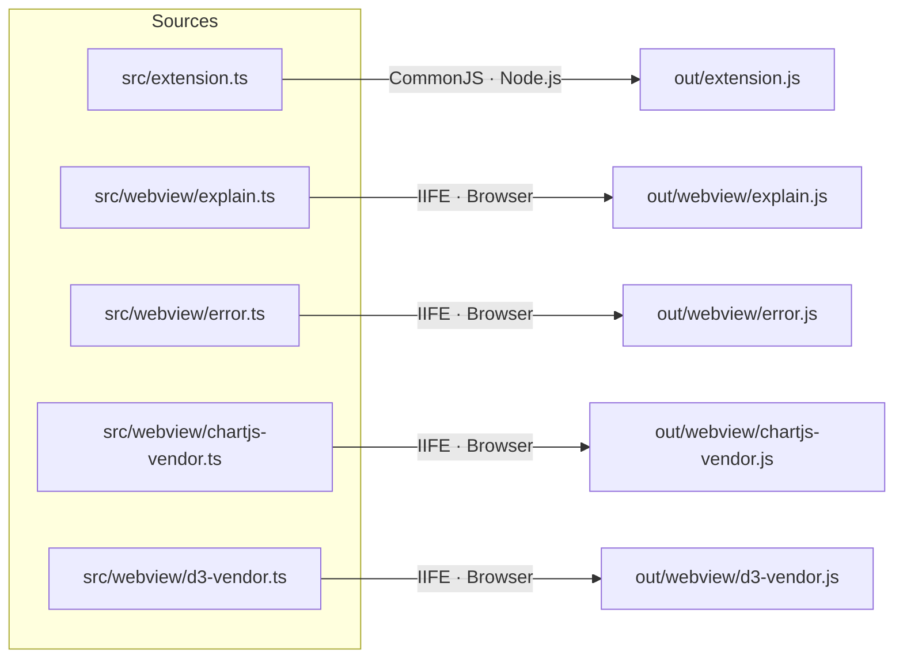
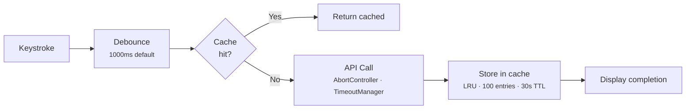

# Architecture Overview

## Build System (esbuild)

The VS Code extension build produces five esbuild bundles. The dashboard's
script is generated inline by `DashboardViewProvider` so its markup and
message protocol stay in one implementation.

```mermaid
flowchart LR
    subgraph Sources
        EXT["src/extension.ts"]
        EXP["src/webview/explain.ts"]
        ERR["src/webview/error.ts"]
        CHART["src/webview/chartjs-vendor.ts"]
        D3["src/webview/d3-vendor.ts"]
    end

    EXT -->|CommonJS · Node.js| O1["out/extension.js"]
    EXP -->|IIFE · Browser| O2["out/webview/explain.js"]
    ERR -->|IIFE · Browser| O3["out/webview/error.js"]
    CHART -->|IIFE · Browser| O4["out/webview/chartjs-vendor.js"]
    D3 -->|IIFE · Browser| O5["out/webview/d3-vendor.js"]
```

Only `vscode` is externalized from the extension-host bundle. Other extension dependencies (including `@anthropic-ai/claude-agent-sdk`, `@opencode-ai/sdk`, and `sidekick-shared`) are bundled by esbuild. Chart.js and D3.js are bundled into local browser vendor files so the dashboard and mind map work offline.

## Entry Point

`src/extension.ts` contains the `activate()` function which registers all commands, providers, and services.

## Package Structure

| Package            | Purpose                                                                                                                  | Build   |
| ------------------ | ------------------------------------------------------------------------------------------------------------------------ | ------- |
| `sidekick-vscode/` | VS Code extension (UI, monitoring, inference)                                                                            | esbuild |
| `sidekick-shared/` | Pure TS library — readers, types, session providers, schemas, extractors, model pricing, quota polling (no VS Code deps) | tsc     |
| `sidekick-cli/`    | CLI binary — dashboard, one-shot commands, markdown/JSON output                                                          | esbuild |

[`sidekick-shared`](https://www.npmjs.com/package/sidekick-shared) extracts the data access layer from the extension so it can be consumed by the CLI, third-party tools, and custom integrations. It is published as a standalone npm package (`npm install sidekick-shared`) with no VS Code dependencies. Key modules include Zod schemas for runtime JSONL validation, pure extractors (`extractTokenUsage`, `extractToolCall`, `extractToolCalls`), Node-only actionable asset extraction (`gatherAssetsForCwd`, `readClaudeAssets`, `readCodexAssets`), model info and pricing (`getModelInfo`, `shortModelName`, `formatCost`, with normalized non-double-counting cost via `normalizeProviderUsage` / `extractNormalizedUsage` / `calculateNormalizedUsageCost`; the legacy `calculateCost` / `calculateCostWithProvenance` remain for compatibility but are deprecated), deterministic token estimation (`estimateTextTokens`, `estimateSerializedTokens`), canonical transcript projection (`listRecentSessions`, `readSessionTranscript`, `projectSessionTranscript`) plus the resilient `ObservedSessionCollector` (fingerprint-cached parses and a `subscribe()` push model as of 0.25.0), the `createSessionProviders()` factory that constructs providers without environment I/O and reports unavailable ones as structured diagnostics, a typed `JsonlParser` with optional schema validation, the single-poller `QuotaPoller` class with exponential backoff, and the higher-level `MultiProviderQuotaService` + `CodexQuotaWatcher` that coordinate Claude polling, peak-hours enrichment, and Codex rate-limit watching behind one typed `{ claude?, codex? }` event stream — all three stay dormant while no matching account exists and wake through `onAccountsChanged()`.

Starting in 0.17.4, `sidekick-shared` ships typed subpath entries via a `package.json` `exports` map. Use `sidekick-shared/browser` for pure, filesystem-free helpers safe in webviews and browser bundles (context-window lookup, model parsing, usage normalization and cost math, token estimation, assistant turn and transcript projection), and `sidekick-shared/node` for the Node-only catalog hydration API (prices and context window sizes) plus the persisted store of provider-reported context windows. As of 0.19.1, `sidekick-shared/schemas` exposes the pure Zod boundary schemas (session events, assistant turns, observed-session V1, quota, account status, account management, quota history) fs-free, for validating data at process/IPC edges without pulling in the rest of the library. As of 0.23.0, `sidekick-shared/statusline` exposes the status-line formatter, account selection, quota-snapshot reading, and burn-rate estimation behind the `sidekick statusline` command. As of 0.25.0, every documented subpath declares explicit `types` / `import` / `require` / `default` export conditions and resolves under Vite and TypeScript's legacy `moduleResolution: node` without consumer-side aliases. The package root still exposes the full Node API, including filesystem-backed session asset extraction for CLI and extension-host consumers. Legacy `sidekick-shared/dist/*` deep imports keep resolving via a compat entry — see the [`sidekick-shared` README](https://github.com/cesarandreslopez/sidekick-agent-hub/blob/main/sidekick-shared/README.md#supported-import-paths) for the full import-path table.

## Key Source Locations

| Area              | Location                                                                                                            |
| ----------------- | ------------------------------------------------------------------------------------------------------------------- |
| Entry point       | `src/extension.ts`                                                                                                  |
| Core types        | `src/types.ts`, `src/types/`                                                                                        |
| Prompt templates  | `src/utils/prompts.ts`, `src/utils/analysisPrompts.ts`                                                              |
| Inference clients | `src/services/AuthService.ts`, `MaxSubscriptionClient.ts`, `ApiKeyClient.ts`, `OpenCodeClient.ts`, `CodexClient.ts` |
| Session providers | `src/services/providers/ClaudeCodeSessionProvider.ts`, `OpenCodeSessionProvider.ts`, `CodexSessionProvider.ts`      |
| Webview UI        | `src/webview/` (vanilla TS, bundled as IIFE)                                                                        |
| Session analysis  | `src/services/SessionAnalyzer.ts`, `src/utils/cycleDetector.ts`                                                     |

## Request Management

```mermaid
flowchart LR
    K["Keystroke"] --> D["Debounce<br/><small>1000ms default</small>"]
    D --> CC{"Cache\nhit?"}
    CC -->|Yes| R["Return cached"]
    CC -->|No| API["API Call<br/><small>AbortController · TimeoutManager</small>"]
    API --> CS["Store in cache<br/><small>LRU · 100 entries · 30s TTL</small>"]
    CS --> DI["Display completion"]
```

- **Debouncing**: Configurable delay (default 1000ms) before firing inline completion requests
- **LRU cache**: `CompletionCache` — 100 entries, 30s TTL
- **Cancellation**: `AbortController` linked through `CompletionOptions.signal`
- **Timeouts**: `TimeoutManager` provides per-operation timeouts with context-size scaling

## Persistence

Cross-session data stored in `~/.config/sidekick/`:

| File                                 | Purpose                                                                                                                                                                    |
| ------------------------------------ | -------------------------------------------------------------------------------------------------------------------------------------------------------------------------- |
| `historical-data.json`               | Token/cost/tool usage stats (schema v3: adds capped per-session records with provider/project dimensions)                                                                  |
| `tasks/{projectSlug}.json`           | Kanban board carry-over                                                                                                                                                    |
| `decisions/{projectSlug}.json`       | Decision log                                                                                                                                                               |
| `handoffs/`                          | Session handoff documents                                                                                                                                                  |
| `knowledge-notes/{projectSlug}.json` | Knowledge notes per project                                                                                                                                                |
| `event-logs/`                        | Optional JSONL audit trail                                                                                                                                                 |
| `error-history.json`                 | Categorized per-session error rollups for post-mortem forensics                                                                                                            |
| `pricing-catalog.json`               | Cached LiteLLM catalog — prices and context window sizes (24h TTL, auto-refreshed on activation)                                                                           |
| `observed-context-windows.json`      | Context windows a provider actually reported, per model; outranks the catalog's published maximum                                                                          |
| `usage-cache/`                       | Per-session usage events extracted from session logs, keyed by size and mtime; feeds `sidekick blocks` and the dashboards' billing-block card (pruned least-recently-used) |

The Sidekick CLI reads from these same files, providing terminal access to persisted data without VS Code. Since 0.23.0 the CLI also writes to them: quick-capture commands (`sidekick tasks add`, `sidekick note add`, `sidekick decision add`) merge into the same per-project stores via atomic writes. Since 0.24.4 the root is overridable: every `sidekick-shared` reader and writer — and therefore the CLI — resolves it lazily through `getConfigDir()`, so `SIDEKICK_CONFIG_DIR` or `setConfigDir()` moves all of it. Since 0.24.5 the extension's own stores resolve through the same seam, so the override relocates the extension, the CLI, and any library consumer together.
