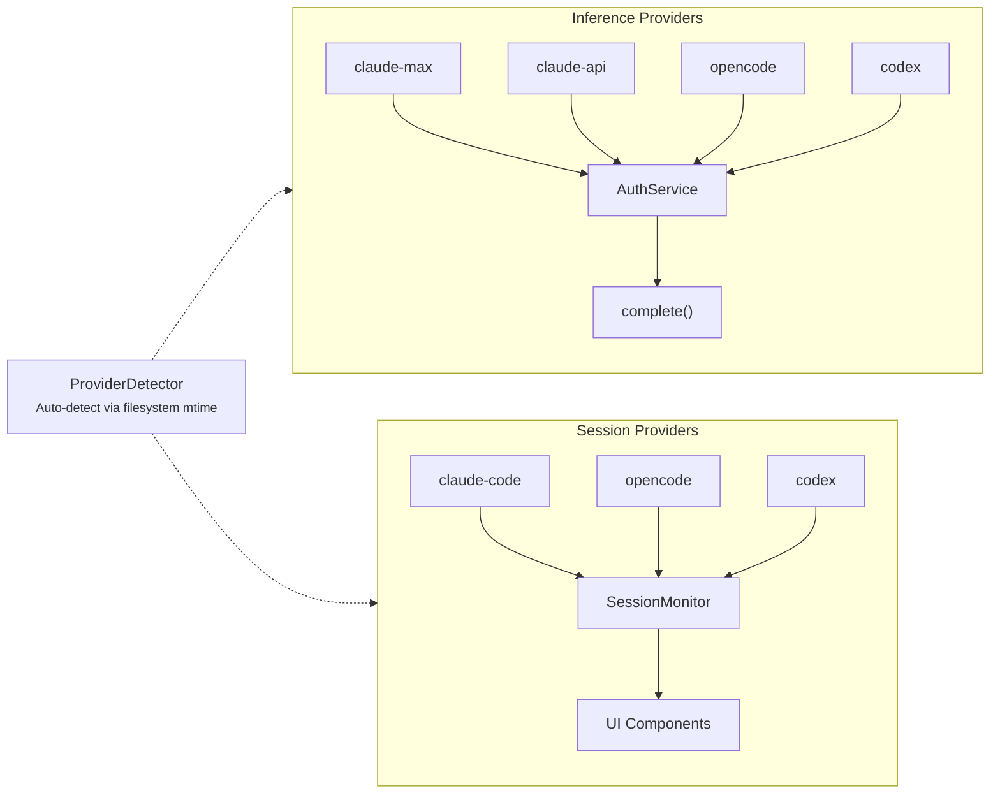

# Provider System

Sidekick has two separate provider concepts that operate independently.



## Inference Providers

Defined as `InferenceProviderId` in `src/types/inferenceProvider.ts`:

| ID | Description | Client |
|----|-------------|--------|
| `claude-max` | Claude via Max subscription | `MaxSubscriptionClient` |
| `claude-api` | Claude via API key | `ApiKeyClient` |
| `opencode` | OpenCode local server | `OpenCodeClient` |
| `codex` | Codex CLI subprocess | `CodexClient` |

All inference clients implement the `ClaudeClient` interface:

```typescript
interface ClaudeClient {
  complete(prompt: string, options?: CompletionOptions): Promise<string>;
  isAvailable(): Promise<boolean>;
  dispose(): void;
}
```

`AuthService` is the central entry point — lazily initializes the correct client and routes all `complete()` calls.

## Session Providers

Defined as `SessionProvider` in `src/types/sessionProvider.ts`:

| ID | Description | Data Source |
|----|-------------|------------|
| `claude-code` | Claude Code sessions | `~/.claude/projects/` |
| `opencode` | OpenCode sessions | `~/.local/share/opencode/` |
| `codex` | Codex CLI sessions | `~/.codex/sessions/` |

Each session provider normalizes raw data into the common `ClaudeSessionEvent` format.

## Auto-Detection

Both provider types support auto-detection via `ProviderDetector`, which checks:

1. Which CLI tools are installed on the system
2. Which have the most recent filesystem activity (mtime)
3. Selects the most recently used provider

## Independence

Inference and session providers are independent — you can use Claude Max for inference while monitoring OpenCode sessions, or any other combination.

## Shared Provider Library

The `sidekick-shared` package ports the session provider implementations for use outside VS Code. It uses the same auto-detection algorithm — checking filesystem presence and most-recent modification time — minus the VS Code setting fallback.

The CLI's `--provider` flag serves as an explicit override when auto-detection isn't appropriate. Providers read session data in the same formats (JSONL, SQLite, JSON) as the extension, so the CLI produces identical results from the same data files.
