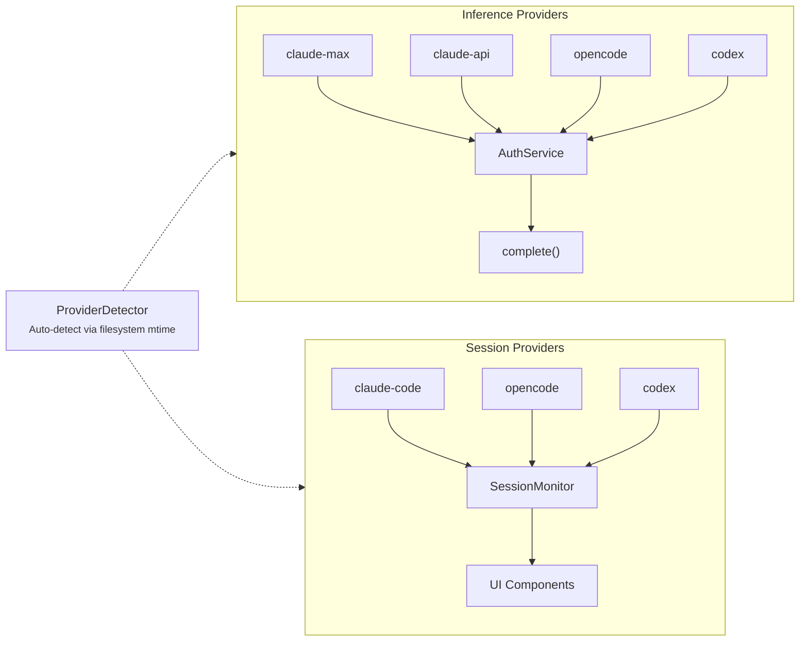

# Provider System

Sidekick has two separate provider concepts that operate independently.


```mermaid
flowchart LR
    subgraph Inference["Inference Providers"]
        direction TB
        CM["claude-max"] --> AS["AuthService"]
        CA["claude-api"] --> AS
        OCI["opencode"] --> AS
        CXI["codex"] --> AS
        AS --> Complete["complete()"]
    end

    subgraph Session["Session Providers"]
        direction TB
        CCS["claude-code"] --> SM["SessionMonitor"]
        OCS["opencode"] --> SM
        CXS["codex"] --> SM
        SM --> UI["UI Components"]
    end

    PD["ProviderDetector<br/><small>Auto-detect via filesystem mtime</small>"]
    PD -.-> Inference
    PD -.-> Session
```

## Inference Providers

Defined as `InferenceProviderId` in `src/types/inferenceProvider.ts`:

| ID           | Description                 | Client                  |
| ------------ | --------------------------- | ----------------------- |
| `claude-max` | Claude via Max subscription | `MaxSubscriptionClient` |
| `claude-api` | Claude via API key          | `ApiKeyClient`          |
| `opencode`   | OpenCode local server       | `OpenCodeClient`        |
| `codex`      | Codex CLI subprocess        | `CodexClient`           |

All inference clients implement the `ClaudeClient` interface:

```typescript
interface ClaudeClient {
  complete(prompt: string, options?: CompletionOptions): Promise<string>;
  isAvailable(): Promise<boolean>;
  dispose(): void;
}
```

`AuthService` is the central entry point — lazily initializes the correct client and routes all `complete()` calls.

## Session Providers

Defined as `SessionProvider` in `src/types/sessionProvider.ts`:

| ID            | Description          | Data Source                                                                                                        |
| ------------- | -------------------- | ------------------------------------------------------------------------------------------------------------------ |
| `claude-code` | Claude Code sessions | `~/.claude/projects/`                                                                                              |
| `opencode`    | OpenCode sessions    | OpenCode data dir (`~/.local/share/opencode/`, `~/Library/Application Support/opencode/`, `%APPDATA%\\opencode\\`) |
| `codex`       | Codex CLI sessions   | `~/.codex/sessions/` (plus legacy profile session dirs recorded under the old per-profile-home model)              |

Each session provider normalizes raw data into the common `ClaudeSessionEvent` format.

### Provider construction and diagnostics

As of `sidekick-shared` 0.25.0, session provider constructors perform no filesystem, configuration, database,
or binary probing — construction cannot fail because of the environment, so a long-lived host can build all
three providers at boot without risk. Environmental failures (a missing `sqlite3` binary, an absent data
directory) are deferred to first use and surface as structured diagnostics rather than exceptions or
silently empty results. Hosts construct through `createSessionProviders({ onDiagnostic })`, which returns
every usable provider plus the coalesced diagnostics, and can resolve a single session with
`findSessionById()` through each provider's native filename or database index.

## Auto-Detection

Both provider types support auto-detection via `ProviderDetector`, which checks:

1. Which CLI tools are installed on the system
2. Which have the most recent filesystem activity (mtime)
3. Selects the most recently used provider

## Independence

Inference and session providers are independent — you can use Claude Max for inference while monitoring OpenCode sessions, or any other combination.

## Account Registry

Account management is provider-aware via a v2 registry format (`~/.config/sidekick/accounts/accounts.json`). Each provider (Claude Code, Codex) maintains its own active account independently — switching Claude accounts does not affect Codex, and vice versa.

- **Claude Code accounts** store backed-up OAuth credentials and identity metadata
- **Codex accounts** store backed-up credentials in isolated profile directories; switching accounts atomically swaps the target profile's credentials into the system `~/.codex/auth.json`, mirroring the Claude switch pattern

The registry auto-migrates from v1 (single-provider) to v2 (multi-provider) on first read. Quota snapshots are cached per provider/account for offline fallback.

### Default account bootstrap

On startup, both the CLI and the VS Code extension call `ensureDefaultAccounts()` from `sidekick-shared`. If an active system Claude Code credential exists and no saved Claude Code account is active yet, it is registered as a **"Default"** account. The same check runs independently for Codex — if `~/.codex/auth.json` exists and no active Codex account is saved yet, a "Default" Codex profile is registered.

The bootstrap is idempotent (repeated calls do not create duplicates), never overwrites accounts that were saved manually, and swallows per-provider errors so they can never block startup. It ensures that quota, analytics, and dashboard surfaces that read from the registry work out of the box, without requiring users to run **`Save Current Claude Account`** / `sidekick account --add` first.

## Shared Provider Library

The [`sidekick-shared`](https://www.npmjs.com/package/sidekick-shared) package is the canonical home of the session provider implementations and the auto-detection algorithm — checking filesystem presence and most-recent modification time. The VS Code extension's `ProviderDetector` is a thin adapter that delegates to shared detection and layers the VS Code setting fallback on top. Any npm project can consume these providers directly via `npm install sidekick-shared`.

The CLI's `--provider` flag serves as an explicit override when auto-detection isn't appropriate. Providers read session data in the same formats (JSONL, SQLite, JSON) as the extension, so the CLI produces identical results from the same data files.
