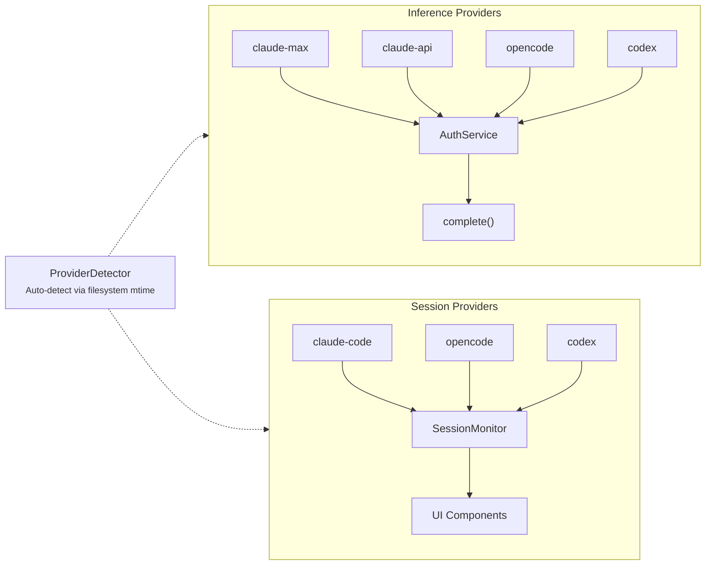

# Provider System

Sidekick has two separate provider concepts that operate independently.


```mermaid
flowchart LR
    subgraph Inference["Inference Providers"]
        direction TB
        CM["claude-max"] --> AS["AuthService"]
        CA["claude-api"] --> AS
        OCI["opencode"] --> AS
        CXI["codex"] --> AS
        AS --> Complete["complete()"]
    end

    subgraph Session["Session Providers"]
        direction TB
        CCS["claude-code"] --> SM["SessionMonitor"]
        OCS["opencode"] --> SM
        CXS["codex"] --> SM
        SM --> UI["UI Components"]
    end

    PD["ProviderDetector<br/><small>Auto-detect via filesystem mtime</small>"]
    PD -.-> Inference
    PD -.-> Session
```

## Inference Providers

Defined as `InferenceProviderId` in `src/types/inferenceProvider.ts`:

| ID           | Description                 | Client                  |
| ------------ | --------------------------- | ----------------------- |
| `claude-max` | Claude via Max subscription | `MaxSubscriptionClient` |
| `claude-api` | Claude via API key          | `ApiKeyClient`          |
| `opencode`   | OpenCode local server       | `OpenCodeClient`        |
| `codex`      | Codex CLI subprocess        | `CodexClient`           |

All inference clients implement the `ClaudeClient` interface:

```typescript
interface ClaudeClient {
  complete(prompt: string, options?: CompletionOptions): Promise<string>;
  isAvailable(): Promise<boolean>;
  dispose(): void;
}
```

`AuthService` is the central entry point — lazily initializes the correct client and routes all `complete()` calls.

## Session Providers

Defined as `ProviderId` and `SessionProviderBase` in `sidekick-shared/src/providers/types.ts`, extended by the VS Code `SessionProvider` in `sidekick-vscode/src/types/sessionProvider.ts`:

| ID            | Description          | Data Source                                                                                                        |
| ------------- | -------------------- | ------------------------------------------------------------------------------------------------------------------ |
| `claude-code` | Claude Code sessions | `~/.claude/projects/`                                                                                              |
| `opencode`    | OpenCode sessions    | OpenCode data dir (`~/.local/share/opencode/`, `~/Library/Application Support/opencode/`, `%APPDATA%\\opencode\\`) |
| `codex`       | Codex CLI sessions   | `~/.codex/sessions/` (plus legacy profile session dirs recorded under the old per-profile-home model)              |

Each session provider normalizes raw data into the canonical `SessionEvent` format (`ClaudeSessionEvent` is a compatibility alias).

### Provider construction and diagnostics

As of `sidekick-shared` 0.25.0, session provider constructors perform no filesystem, configuration, database,
or binary probing — construction cannot fail because of the environment, so a long-lived host can build all
three providers at boot without risk. Environmental failures (a missing `sqlite3` binary, an absent data
directory) are deferred to first use and surface as structured diagnostics rather than exceptions or
silently empty results. Hosts construct through `createSessionProviders({ onDiagnostic })`, which returns
every usable provider plus the coalesced diagnostics, and can resolve a single session with
`findSessionById()` through each provider's native filename or database index.

`ObservedSessionCollector` has its own diagnostic stream. As of 0.26.5 it also emits an **info**-severity
`provider-discovery-completed` diagnostic after every discovery pass, carrying the trigger, duration,
reference count, and directory/file stat counters so a host can see what each pass cost. Hosts that surface
every diagnostic as a problem should branch on `severity`.

## Auto-Detection

Both provider types support auto-detection via `ProviderDetector`, which checks:

1. Which providers have session data on disk
2. Which session data has the most recent activity (mtime)
3. Selects the most recently active provider; explicit settings override detection

Detection does not establish that the inference executable is installed or authenticated. The selected inference client checks availability separately.

## Independence

Inference and session providers are independent — you can use Claude Max for inference while monitoring OpenCode sessions, or any other combination.

## Account Registry

Account management is provider-aware via a v2 registry format (`~/.config/sidekick/accounts/accounts.json`). Each provider (Claude Code, Codex) maintains its own active account independently — switching Claude accounts does not affect Codex, and vice versa.

- **Claude Code accounts** store backed-up OAuth credentials and identity metadata
- **Codex accounts** store backed-up credentials in isolated profile directories; switching accounts atomically swaps the target profile's credentials into the system `~/.codex/auth.json`, mirroring the Claude switch pattern

The registry auto-migrates from v1 (single-provider) to v2 (multi-provider) on first read. Quota snapshots are cached per provider/account for offline fallback.

### Default account bootstrap

The VS Code extension bootstraps accounts in the background. CLI commands that need full startup call `ensureDefaultAccounts()` from `sidekick-shared`; help/version and cache-only `statusline`, `today`, and `history` skip it. As of 0.26.6 the bootstrap runs the one-time on-disk migrations, removes abandoned isolated logins, and then calls `syncLiveAccountState()`: any live Claude Code or Codex login the registry has never seen is registered under its email, a rotated live token is folded back into its saved profile, and the active pointer is re-pointed to whatever is actually logged in. `onAccountsChanged()` runs the same sync on every filesystem or poll event.

The bootstrap is idempotent (repeated calls do not create duplicates), never overwrites accounts that were saved manually, and swallows per-provider errors so they can never block startup. It ensures that quota, analytics, and dashboard surfaces that read from the registry work out of the box, without requiring users to run **Register Current Login** / `sidekick accounts add --current` first.

## Shared Provider Library

The [`sidekick-shared`](https://www.npmjs.com/package/sidekick-shared) package is the canonical home of the session provider implementations and the auto-detection algorithm — checking filesystem presence and most-recent modification time. The VS Code extension's `ProviderDetector` is a thin adapter that delegates to shared detection and layers the VS Code setting fallback on top. Any npm project can consume these providers directly via `npm install sidekick-shared`.

The CLI's `--provider` flag serves as an explicit override when auto-detection isn't appropriate. Providers read session data in the same formats (JSONL, SQLite, JSON) as the extension, so the CLI produces identical results from the same data files.

## Provider failure and service evidence

`sidekick-shared` exposes two separate APIs for Claude Code and Codex:

- `diagnoseProviderFailure()` is pure and available through root and browser. It classifies caller-designated terminal errors into bounded diagnosis and recovery identifiers, preserving evidence provenance and optional HTTP/retry-after information without raw errors or credentials. Consumers supply the credential kind and may supply timestamped authentication observations.
- `fetchProviderServiceStatus()` is available through root and Node, with result types through browser. It fetches the official public summary once without credentials and with a ten-second deadline and optional cancellation. `availability: observed` retains reported severity, components, incidents, associations, and independent check/provider-update timestamps. `availability: unavailable` carries a bounded reason and no severity. Omitted incidents are `null`, distinct from an explicit empty array.

Authentication, request outcomes, CLI readiness, and public status are separate observations. A 5xx or connection reset does not establish rejected credentials; a provider thread failure does not establish account sign-out. A successful local OAuth check cannot validate an API key or override explicit rejection from the actual request. An explicit refresh-token rejection outranks overlapping conversation-expiry wording, expired-login and re-authentication messages resolve by credential kind, and `denied by policy` is an execution-policy denial even without a distinguishing status; a bare 403 stays unknown. Public incidents do not establish request causation, and an operational public page does not prove the user's connection works. Unknown component mappings and custom endpoints remain uncorrelated.

The extension uses these APIs for terminal inference guidance and public status cards; the CLI uses them for AI summary failures, `status`, dashboard details, and Doctor. Missing or partial public evidence remains visible. Local readiness checks are labeled separately from authenticated request success. Polling, cancellation, coalescing, and cached display state belong to the host services.

The caller retains control over SDK event terminality and recovery. These APIs do not sign in, modify credentials, switch providers, invoke models, or replay turns. Legacy status functions and the transcript/tool and quota taxonomies remain compatible. See the [shared package API examples](https://github.com/cesarandreslopez/sidekick-agent-hub/blob/main/sidekick-shared/README.md#diagnose-terminal-provider-failures).
