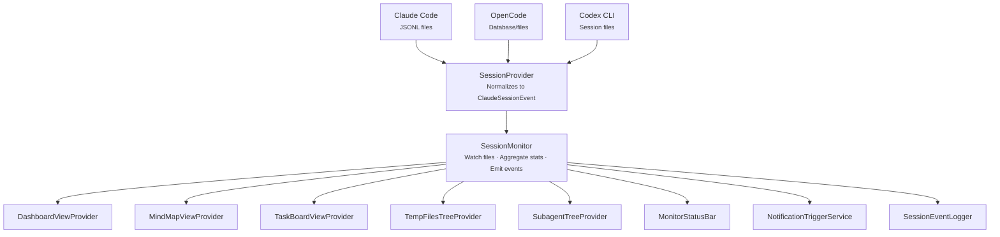

# Session Monitoring Pipeline

The session monitoring system follows a pipeline architecture from raw CLI data to UI.

## Pipeline Flow

## SessionProvider

Each CLI agent stores session data differently. Provider implementations in `src/services/providers/` normalize raw data into the common `ClaudeSessionEvent` format defined in `src/types/claudeSession.ts`.

| Provider | Data Source | Format |
|----------|------------|--------|
| Claude Code | `~/.claude/projects/` | JSONL files |
| OpenCode | `~/.local/share/opencode/` | Database/files |
| Codex CLI | `~/.codex/sessions/` | Session files |

## SessionMonitor

The `SessionMonitor` class:

1. Watches session files for changes via filesystem polling
2. Parses new entries using `JsonlParser` with line buffering
3. Aggregates statistics (tokens, costs, tool usage)
4. Emits typed events consumed by UI components

## UI Consumers

| Consumer | Purpose |
|----------|---------|
| `DashboardViewProvider` | Token usage, costs, timeline, analytics |
| `MindMapViewProvider` | D3.js session structure graph |
| `TaskBoardViewProvider` | Kanban board with task/agent tracking |
| `TempFilesTreeProvider` | Files modified during session |
| `SubagentTreeProvider` | Spawned agent monitoring |
| `MonitorStatusBar` | Status bar metrics |
| `NotificationTriggerService` | Alert system |
| `SessionEventLogger` | Optional JSONL audit trail |
