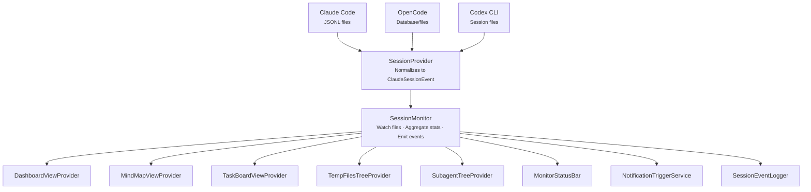

# Session Monitoring Pipeline

The session monitoring system follows a pipeline architecture from raw CLI data to UI.

## Pipeline Flow

## SessionProvider

Each CLI agent stores session data differently. Provider implementations in `src/services/providers/` normalize raw data into the common `ClaudeSessionEvent` format defined in `src/types/claudeSession.ts`.

| Provider | Data Source | Format |
|----------|------------|--------|
| Claude Code | `~/.claude/projects/` | JSONL files |
| OpenCode | `~/.local/share/opencode/` | Database/files |
| Codex CLI | `~/.codex/sessions/` | Session files |

## SessionMonitor

The `SessionMonitor` class:

1. Watches session files for changes via filesystem polling
2. Parses new entries using `JsonlParser` with line buffering
3. Aggregates statistics (tokens, costs, tool usage)
4. Runs detection systems on incoming events (truncation, context health, goal gates, cycles)
5. Emits typed events consumed by UI components

### Detection Systems

Four detection systems run inline as events arrive:

| System | Trigger | Output |
|--------|---------|--------|
| **Truncation Detection** | Every tool result | Scans for 6 truncation markers, records per-tool counts, fires `_onTruncation` event |
| **Context Health** | Compaction events | Calculates fidelity score from compaction count and reclaimed percentage |
| **Goal Gate Detection** | Task create/update | Flags tasks matching critical keywords or blocking 3+ other tasks |
| **Cycle Detection** | Every tool call | Sliding-window signature hashing via `cycleDetector.ts`, throttled to 60s intervals |

These systems feed their results into the dashboard, handoffs, notifications, mind map, and knowledge note candidate extraction.

## UI Consumers

| Consumer | Purpose |
|----------|---------|
| `DashboardViewProvider` | Token usage, costs, timeline, analytics |
| `MindMapViewProvider` | D3.js session structure graph |
| `TaskBoardViewProvider` | Kanban board with task/agent tracking |
| `TempFilesTreeProvider` | Files modified during session |
| `SubagentTreeProvider` | Spawned agent monitoring |
| `MonitorStatusBar` | Status bar metrics |
| `NotificationTriggerService` | Alert system |
| `SessionEventLogger` | Optional JSONL audit trail |

## CLI Reader Path

The `sidekick-shared` library provides a read-only alternative to the SessionMonitor pipeline. Instead of watching files in real time, the CLI reads session data on demand — useful for loading context at session start or querying session history in batch.

