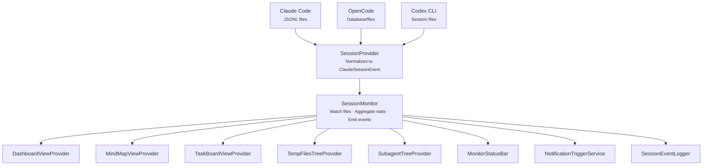

# Session Monitoring Pipeline

The session monitoring system follows a pipeline architecture from raw CLI data to UI.

## Pipeline Flow

```mermaid
flowchart TD
    CC["Claude Code<br/><small>JSONL files</small>"] --> SP
    OC["OpenCode<br/><small>Database/files</small>"] --> SP
    CX["Codex CLI<br/><small>Session files</small>"] --> SP

    SP["SessionProvider<br/><small>Normalizes to ClaudeSessionEvent</small>"]
    SP --> SM["SessionMonitor<br/><small>Watch files · Aggregate stats · Emit events</small>"]

    SM --> Dashboard["DashboardViewProvider"]
    SM --> MindMap["MindMapViewProvider"]
    SM --> Kanban["TaskBoardViewProvider"]
    SM --> Files["TempFilesTreeProvider"]
    SM --> Agents["SubagentTreeProvider"]
    SM --> StatusBar["MonitorStatusBar"]
    SM --> Notify["NotificationTriggerService"]
    SM --> Logger["SessionEventLogger"]
```

## SessionProvider

Each CLI agent stores session data differently. Provider implementations in `src/services/providers/` normalize raw data into the common `ClaudeSessionEvent` format defined in `src/types/claudeSession.ts`.

| Provider    | Data Source                                                                                                        | Format                          |
| ----------- | ------------------------------------------------------------------------------------------------------------------ | ------------------------------- |
| Claude Code | `~/.claude/projects/`                                                                                              | JSONL files                     |
| OpenCode    | OpenCode data dir (`~/.local/share/opencode/`, `~/Library/Application Support/opencode/`, `%APPDATA%\\opencode\\`) | `opencode.db` plus legacy files |
| Codex CLI   | `~/.codex/sessions/`                                                                                               | Session files                   |

## SessionMonitor

The `SessionMonitor` class:

1. Watches session files for changes via filesystem polling
2. Parses new entries using `JsonlParser` with line buffering
3. Aggregates statistics (tokens, costs, tool usage)
4. Runs detection systems on incoming events (truncation, context health, goal gates, cycles)
5. Emits typed events consumed by UI components

### Detection Systems

Four detection systems run inline as events arrive:

| System                   | Trigger            | Output                                                                               |
| ------------------------ | ------------------ | ------------------------------------------------------------------------------------ |
| **Truncation Detection** | Every tool result  | Scans for 6 truncation markers, records per-tool counts, fires `_onTruncation` event |
| **Context Health**       | Compaction events  | Calculates fidelity score from compaction count and reclaimed percentage             |
| **Goal Gate Detection**  | Task create/update | Flags tasks matching critical keywords or blocking 3+ other tasks                    |
| **Cycle Detection**      | Every tool call    | Sliding-window signature hashing via `cycleDetector.ts`, throttled to 60s intervals  |

These systems feed their results into the dashboard, handoffs, notifications, mind map, and knowledge note candidate extraction.

## UI Consumers

| Consumer                     | Purpose                                 |
| ---------------------------- | --------------------------------------- |
| `DashboardViewProvider`      | Token usage, costs, timeline, analytics |
| `MindMapViewProvider`        | D3.js session structure graph           |
| `TaskBoardViewProvider`      | Kanban board with task/agent tracking   |
| `TempFilesTreeProvider`      | Files modified during session           |
| `SubagentTreeProvider`       | Spawned agent monitoring                |
| `MonitorStatusBar`           | Status bar metrics                      |
| `NotificationTriggerService` | Alert system                            |
| `SessionEventLogger`         | Optional JSONL audit trail              |

## CLI Reader Path

The [`sidekick-shared`](https://www.npmjs.com/package/sidekick-shared) library provides a read-only alternative to the SessionMonitor pipeline. Instead of watching files in real time, the CLI reads session data on demand — useful for loading context at session start or querying session history in batch. Third-party tools can consume the same library directly (`npm install sidekick-shared`).

Codex sessions flow through the same canonical path as the other providers: a `ProviderReaderSessionWatcher` (or a one-shot reader) yields canonical `SessionEvent`s, and `parseTranscriptFromEvents()` turns those into the transcript used by the dashboard, reports, and project timeline. This keeps the CLI and the VS Code extension rendering identical evidence for a given session.

### Canonical usage and transcript projection

Provider readers normalize usage before aggregation. Claude/Anthropic cache categories are additive; Codex/OpenAI cached input is removed from the uncached-input category, and reasoning that is already included in output remains visible without being counted or priced twice. Unknown pricing remains unpriced rather than appearing as zero. The browser-safe `projectSessionTranscript()` consumes those same canonical events; Node consumers use `listRecentSessions()` and `readSessionTranscript()` so history does not need another JSONL parser hierarchy. Each projected message retains provider provenance on `source` — entrypoint, meta/sidechain flags, original role, cwd, and git branch — so consumers can distinguish human prompts from orchestration without reparsing JSONL.

`ObservedSessionCollector` adds host-scheduled collection around the provider adapters. Provider-backed sources from `observedSessionSourceFromProvider()` expose the adapter's `ProviderCapabilitiesV1` record. Provider discovery and each session read fail independently, with bounded retry backoff, fingerprint-change bypass, duplicate-failure suppression, and observable recovery. `collect()` deliberately does not own timers, logging sinks, UI events, or product-specific control/session projection; the opt-in `subscribe()` (0.25.0) is the exception, owning its own debounce, filesystem-watch, and catch-up-poll timers to deliver coalesced change batches, while parses stay fingerprint-cached so unchanged sessions cost no content reads.

### Session context evidence snapshots

On top of the reader path, `buildSessionContextSnapshot()` / `readSessionContextSnapshot()` project a provider-neutral view of what an assistant has "seen" in a session — layered evidence sources (system, user prompts, tool inputs/outputs, thinking), a low/medium/high **context pressure** band, and observed **capabilities** (tools, MCP servers, permission mode, rate limits). `createSessionContextProjector()` builds the snapshot incrementally as new events stream in. Every session provider exposes `readSessionContextSnapshot()`.
