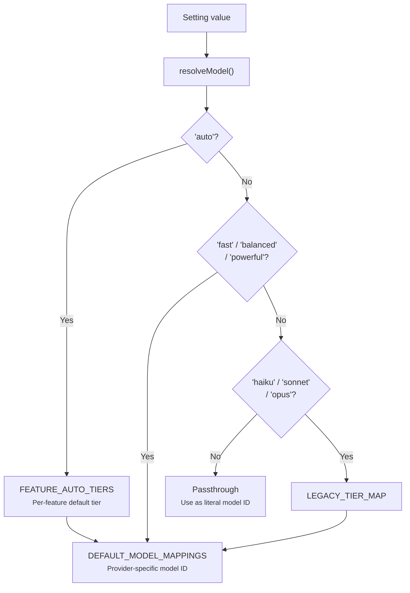

# Model Resolution

Sidekick uses a tier-based model resolution system that maps abstract tiers to provider-specific model IDs.

## Resolution Flow

## Tiers

| Tier | Use Case | Claude Model |
|------|----------|-------------|
| `fast` | Low latency, frequent calls (inline completions, docs) | Haiku |
| `balanced` | Quality/speed tradeoff (explanations, commits, review) | Sonnet |
| `powerful` | Highest quality (code transforms) | Opus |

## Per-Feature Defaults

When a model setting is `"auto"`, it resolves to the recommended tier for that feature:

| Feature | Default Tier |
|---------|-------------|
| Inline completions | fast |
| Documentation | fast |
| Code transforms | powerful |
| Commit messages | balanced |
| Explanations | balanced |
| Error analysis | balanced |
| Inline chat | balanced |
| Code review | balanced |
| PR descriptions | balanced |

## Legacy Names

For backward compatibility, legacy Claude model names are mapped to tiers:

| Legacy Name | Maps To |
|-------------|---------|
| `haiku` | fast |
| `sonnet` | balanced |
| `opus` | powerful |

## Literal Model IDs

You can bypass the tier system entirely by setting a full model ID (e.g., `claude-sonnet-4-5-20250514`). This is passed directly to the provider without any mapping.
