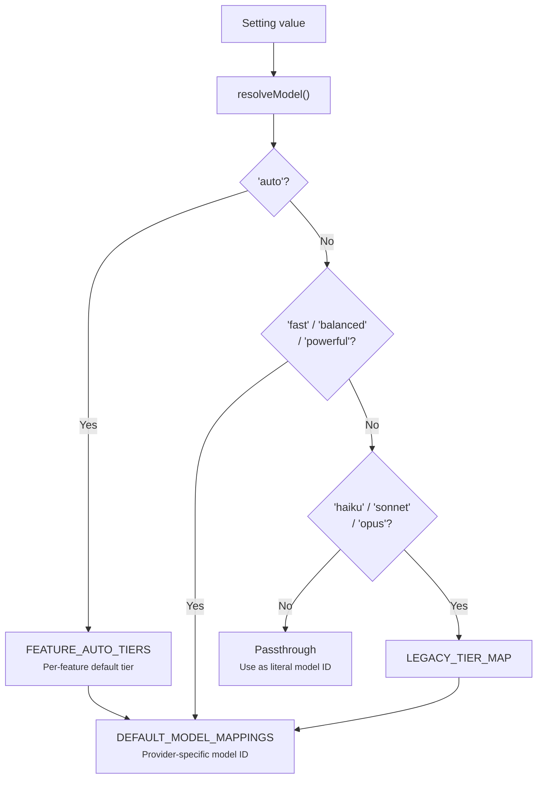

# Model Resolution

Sidekick uses a tier-based model resolution system that maps abstract tiers to provider-specific model IDs.

## Resolution Flow

```mermaid
flowchart TD
    Input["Setting value"] --> RM["resolveModel()"]
    RM --> IsAuto{"'auto'?"}
    IsAuto -->|Yes| FAT["FEATURE_AUTO_TIERS<br/><small>Per-feature default tier</small>"]
    FAT --> DMM

    IsAuto -->|No| IsTier{"'fast' / 'balanced'<br/>/ 'powerful'?"}
    IsTier -->|Yes| DMM["DEFAULT_MODEL_MAPPINGS<br/><small>Provider-specific model ID</small>"]

    IsTier -->|No| IsLegacy{"'haiku' / 'sonnet'<br/>/ 'opus'?"}
    IsLegacy -->|Yes| LTM["LEGACY_TIER_MAP"] --> DMM

    IsLegacy -->|No| Pass["Passthrough<br/><small>Use as literal model ID</small>"]
```

## Tiers

| Tier       | Use Case                                               | Claude Model | Codex Model     |
| ---------- | ------------------------------------------------------ | ------------ | --------------- |
| `fast`     | Low latency, frequent calls (inline completions, docs) | Haiku 4.5    | `gpt-5.6-luna`  |
| `balanced` | Quality/speed tradeoff (explanations, commits, review) | Sonnet 5     | `gpt-5.6-terra` |
| `powerful` | Highest quality (code transforms)                      | Opus 5       | `gpt-5.6-sol`   |

The Claude column resolves per inference provider: `claude-max` passes the short
names (`haiku` / `sonnet` / `opus`) to the CLI, while `claude-api` and `opencode`
resolve to versioned IDs such as `claude-sonnet-5` and `claude-opus-5` (with an
`anthropic/` prefix for OpenCode). Native Claude aliases follow the installed
CLI's model mapping.

These defaults were reviewed on September 5, 2026 against the
[Anthropic model overview](https://platform.claude.com/docs/en/models/overview)
and [OpenAI model guidance](https://developers.openai.com/api/docs/guides/latest-model?model=gpt-5.6).

## Per-Feature Defaults

When a model setting is `"auto"`, it resolves to the recommended tier for that feature:

| Feature            | Default Tier |
| ------------------ | ------------ |
| Inline completions | fast         |
| Documentation      | fast         |
| Code transforms    | powerful     |
| Commit messages    | balanced     |
| Explanations       | balanced     |
| Error analysis     | balanced     |
| Inline chat        | balanced     |
| Code review        | balanced     |
| PR descriptions    | balanced     |

## Legacy Names

For backward compatibility, legacy Claude model names are mapped to tiers:

| Legacy Name | Maps To  |
| ----------- | -------- |
| `haiku`     | fast     |
| `sonnet`    | balanced |
| `opus`      | powerful |

## Literal Model IDs

You can bypass the tier system entirely by setting a full model ID (e.g., `claude-sonnet-5` or `gpt-5.6-sol`). This is passed directly to the provider without any mapping.

Use `claude-fable-5-1` or `gpt-6-astra` explicitly for the newest flagships when
your provider account supports them. The automatic powerful tier uses Opus 5
or Sol.

## CLI Dashboard Summaries

The CLI dashboard has separate inference defaults for its short session
summaries. Direct Anthropic API calls use `claude-haiku-4-5-20251001`; direct
OpenAI API calls use `gpt-5.6-luna` with reasoning disabled and a 1,024-token
completion limit. Summaries generated through `claude --print` or `codex exec`
inherit the native CLI's model configuration.

## Pricing and Context Metadata

The shared model catalog supplies cost estimates and context gauges to the CLI
and VS Code. Catalog hydration reuses cached LiteLLM data for up to 24 hours,
then attempts a refresh. Bundled metadata covers models missing from the catalog. Observed context windows
take precedence over published limits when they match the same model, so a
provider's effective account limit can be smaller than the published maximum.
Quota utilization comes from separate provider APIs or local samples.

The bundled metadata was refreshed on September 5, 2026 using
[Anthropic pricing](https://platform.claude.com/docs/en/about-claude/pricing)
and the OpenAI model pages for
[Sol](https://developers.openai.com/api/docs/models/gpt-5.6-sol),
[Terra](https://developers.openai.com/api/docs/models/gpt-5.6-terra),
[Luna](https://developers.openai.com/api/docs/models/gpt-5.6-luna),
[Astra](https://developers.openai.com/api/docs/models/gpt-6-astra),
[GPT-5.4 mini](https://developers.openai.com/api/docs/models/gpt-5.4-mini), and
[GPT-5.4 nano](https://developers.openai.com/api/docs/models/gpt-5.4-nano).
It includes Fable 5.1's lower cache-read rate, Astra's pricing and context limit,
current GPT-5.6 rates, and the smaller GPT-5.4 mini/nano context windows. Sonnet
5's $2/$10 input/output rates are now permanent. Prices remain estimates at
standard rates; service tiers and other billing adjustments can change actual
charges.
