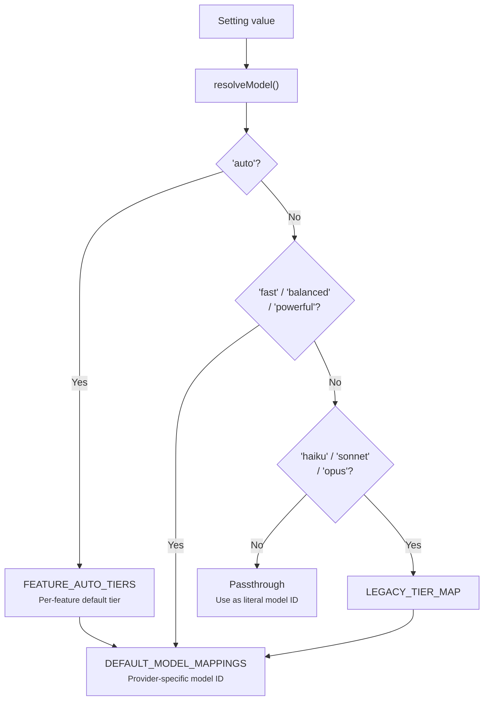

# Model Resolution

Sidekick uses a tier-based model resolution system that maps abstract tiers to provider-specific model IDs.

## Resolution Flow

```mermaid
flowchart TD
    Input["Setting value"] --> RM["resolveModel()"]
    RM --> IsAuto{"'auto'?"}
    IsAuto -->|Yes| FAT["FEATURE_AUTO_TIERS<br/><small>Per-feature default tier</small>"]
    FAT --> DMM

    IsAuto -->|No| IsTier{"'fast' / 'balanced'<br/>/ 'powerful'?"}
    IsTier -->|Yes| DMM["DEFAULT_MODEL_MAPPINGS<br/><small>Provider-specific model ID</small>"]

    IsTier -->|No| IsLegacy{"'haiku' / 'sonnet'<br/>/ 'opus'?"}
    IsLegacy -->|Yes| LTM["LEGACY_TIER_MAP"] --> DMM

    IsLegacy -->|No| Pass["Passthrough<br/><small>Use as literal model ID</small>"]
```

## Tiers

| Tier       | Use Case                                               | Claude Model | Codex Model    |
| ---------- | ------------------------------------------------------ | ------------ | -------------- |
| `fast`     | Low latency, frequent calls (inline completions, docs) | Haiku        | `gpt-5.4-mini` |
| `balanced` | Quality/speed tradeoff (explanations, commits, review) | Sonnet       | `gpt-5.6-sol`  |
| `powerful` | Highest quality (code transforms)                      | Opus         | `gpt-5.6-sol`  |

The Claude column resolves per inference provider: `claude-max` passes the short
names (`haiku` / `sonnet` / `opus`) to the CLI, while `claude-api` and `opencode`
resolve to pinned IDs such as `claude-sonnet-5` and `claude-opus-5`. Codex maps
its `balanced` and `powerful` tiers to the same model.

## Per-Feature Defaults

When a model setting is `"auto"`, it resolves to the recommended tier for that feature:

| Feature            | Default Tier |
| ------------------ | ------------ |
| Inline completions | fast         |
| Documentation      | fast         |
| Code transforms    | powerful     |
| Commit messages    | balanced     |
| Explanations       | balanced     |
| Error analysis     | balanced     |
| Inline chat        | balanced     |
| Code review        | balanced     |
| PR descriptions    | balanced     |

## Legacy Names

For backward compatibility, legacy Claude model names are mapped to tiers:

| Legacy Name | Maps To  |
| ----------- | -------- |
| `haiku`     | fast     |
| `sonnet`    | balanced |
| `opus`      | powerful |

## Literal Model IDs

You can bypass the tier system entirely by setting a full model ID (e.g., `claude-sonnet-5` or `gpt-5.6-sol`). This is passed directly to the provider without any mapping.
