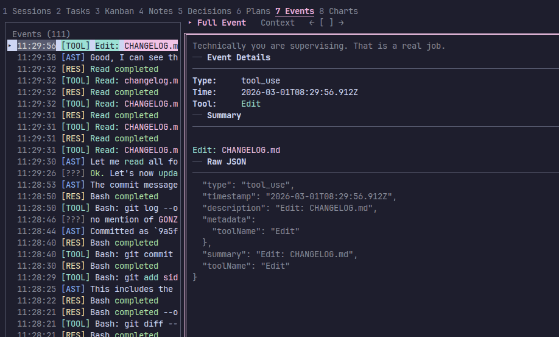

# Sidekick CLI

The Sidekick CLI provides a full-screen terminal dashboard for monitoring agent sessions — standalone, no VS Code required. It reads from the same `~/.config/sidekick/` data files the VS Code extension writes.


!!! warning "Package name vs binary name"
    The npm package is `sidekick-agent-hub`, but the binary it installs is called **`sidekick`**. After installation, run `sidekick dashboard` — not `sidekick-agent-hub`.

## Installation

```bash
npm install -g sidekick-agent-hub
```

Requires **Node.js 20+**.

Or build from source:

```bash
bash scripts/build-all.sh
```

This compiles `sidekick-shared` (the data access library) and `sidekick-cli` (the binary). The CLI is output to `sidekick-cli/dist/sidekick-cli.mjs`.

## Quick Start

1. `cd` into your project directory
2. Run `sidekick dashboard`
3. The dashboard auto-detects your project path and session provider
4. Press `?` to see all keybindings

If you have sessions from multiple providers, the most recently active one is selected automatically. Override with `--provider`.

## Command Reference

```bash
sidekick dashboard [options]
```

| Flag | Description |
|------|-------------|
| `--project <path>` | Override project path (default: current working directory) |
| `--provider <id>` | Session provider: `claude-code`, `opencode`, `codex`, or `auto` (default) |
| `--session <id>` | Follow a specific session by ID (default: most recent or session picker) |
| `--replay` | Replay existing events from the beginning before streaming live |

### Examples

```bash
# Launch for the current directory
sidekick dashboard

# Monitor a specific project
sidekick dashboard --project ~/code/my-app

# Force Claude Code as the provider
sidekick dashboard --provider claude-code

# Follow a specific session with full replay
sidekick dashboard --session abc123 --replay
```

## Session Dump

```bash
sidekick dump [options]
```

Dump session data as a text timeline, JSON metrics, or markdown report for sharing or archiving.

| Flag | Description |
|------|-------------|
| `--list` | List available session IDs for the current project |
| `--format <fmt>` | Output format: `text` (default), `json`, or `markdown` |
| `--width <cols>` | Terminal width for text output (default: auto-detect) |
| `--expand` | Show all events including noise |
| `--session <id>` | Target a specific session (default: most recent) |

Global flags `--project`, `--provider`, and `--json` also apply (see above).

### Examples

```bash
# Dump the latest session as plain text
sidekick dump

# Export as markdown for sharing
sidekick dump --format markdown > session-report.md

# Full JSON export for tooling
sidekick dump --format json > session.json
```

## HTML Report

```bash
sidekick report [options]
```

Generate a self-contained HTML session report and open it in the default browser. Includes full transcript with collapsible thinking blocks and tool detail, token/cost stats, model breakdown, and tool-use summary — zero external dependencies.


| Flag | Description |
|------|-------------|
| `--session <id>` | Target a specific session (default: most recent) |
| `--output <path>` | Write to a specific file (default: temp file) |
| `--theme <theme>` | Color theme: `dark` (default) or `light` |
| `--no-open` | Write the file without opening the browser |
| `--no-thinking` | Omit thinking blocks from the transcript |

Global flags `--project` and `--provider` also apply (see above).

### Examples

```bash
# Generate report for the latest session and open in browser
sidekick report

# Light theme, save to a specific file
sidekick report --theme light --output ~/reports/session.html

# Generate without opening browser
sidekick report --no-open --output session.html
```

You can also press `r` in the TUI dashboard to generate and open a report for the current session.

## Data Commands

Standalone commands that query Sidekick's persisted project data without launching the TUI dashboard. All accept the global flags `--project`, `--provider`, and `--json`.

### Tasks

```bash
sidekick tasks [options]
```

List persisted tasks for the current project. Tasks carry over across sessions from `~/.config/sidekick/tasks/`.

| Flag | Description |
|------|-------------|
| `--status <status>` | Filter by status: `pending`, `completed`, or `all` (default: `all`) |

#### Examples

```bash
# List all tasks
sidekick tasks

# Show only pending tasks
sidekick tasks --status pending

# JSON output for scripting
sidekick tasks --json
```

### Decisions

```bash
sidekick decisions [options]
```

List architectural decisions extracted from sessions. Stored in `~/.config/sidekick/decisions/`.

| Flag | Description |
|------|-------------|
| `--search <query>` | Filter decisions by keyword |
| `--limit <n>` | Maximum number of decisions to show |

#### Examples

```bash
# List all decisions
sidekick decisions

# Search for decisions about database choices
sidekick decisions --search "database"

# Show the 5 most recent decisions as JSON
sidekick decisions --limit 5 --json
```

### Notes

```bash
sidekick notes [options]
```

List knowledge notes (gotchas, patterns, guidelines, tips) attached to files in the current project.

| Flag | Description |
|------|-------------|
| `--file <path>` | Filter notes by file path |
| `--type <type>` | Filter by type: `gotcha`, `pattern`, `guideline`, or `tip` |
| `--status <status>` | Filter by status: `active`, `needs_review`, `stale`, or `obsolete` |

#### Examples

```bash
# List all notes
sidekick notes

# Show only gotchas
sidekick notes --type gotcha

# Notes for a specific file
sidekick notes --file src/services/AuthService.ts

# Active tips as JSON
sidekick notes --type tip --status active --json
```

### Stats

```bash
sidekick stats [options]
```

Show historical usage statistics — tokens, costs, model breakdown, tool usage, and recent daily activity. Reads from `~/.config/sidekick/historical-data.json`.

No command-specific flags. Use `--json` for machine-readable output.

#### Examples

```bash
# Print a formatted stats summary
sidekick stats

# Export raw historical data as JSON
sidekick stats --json
```

### Handoff

```bash
sidekick handoff [options]
```

Show the latest session handoff document for the current project. Handoff documents are continuity notes left by an agent at the end of a session.

No command-specific flags. Use `--json` for machine-readable output.

#### Examples

```bash
# Display the latest handoff
sidekick handoff

# Pipe handoff content into another tool
sidekick handoff --json | jq -r '.content'
```

### Search

```bash
sidekick search <query> [options]
```

Full-text search across all sessions. Results include matched snippets with highlighted terms, event types, timestamps, and session/project paths.

| Flag | Description |
|------|-------------|
| `--limit <n>` | Maximum number of results (default: 50) |

#### Examples

```bash
# Search for mentions of a function
sidekick search "resolveModel"

# Limit results and output as JSON
sidekick search "database migration" --limit 10 --json

# Search within a specific project
sidekick search "auth bug" --project ~/code/my-app
```

### Context

```bash
sidekick context [options]
```

Output composite project context — tasks, decisions, notes, handoff, stats, and recent sessions in a single document. Useful for piping into LLM prompts or other tools.

| Flag | Description |
|------|-------------|
| `--fidelity <level>` | Detail level: `full` (default), `compact`, or `brief` |

#### Examples

```bash
# Full context for the current project
sidekick context

# Compact summary for LLM prompts
sidekick context --fidelity compact

# Brief context as JSON
sidekick context --fidelity brief --json
```

## Dashboard Overview

The dashboard is a two-pane Ink-based terminal UI. The left pane shows a navigable list of items (sessions, tasks, notes, etc.), and the right pane shows details for the selected item.

### Layout Modes

Press `z` to cycle through three layout modes:

| Mode | Description |
|------|-------------|
| **Normal** | Default two-pane split — side list and detail pane side by side |
| **Expanded** | Side list hidden, detail pane fills the entire screen |
| **Wide Side** | Wider side list for longer item labels |

Minimum terminal size: 60 columns wide, 15 rows tall.

## Dashboard Panels

Switch panels with number keys `1`–`8`.

### Sessions (1)

Browse and select from recent agent sessions. The detail pane has seven tabs:

| Tab | Description |
|-----|-------------|
| **Summary** | Token usage, cost, duration, model, and session metadata |
| **Timeline** | Chronological activity feed with tool calls, messages, and events |
| **Mind Map** | Terminal-rendered graph of session structure — files, tools, tasks, and relationships. Press `v` to cycle views (tree/boxed/flow), `f` to filter node types |
| **Tools** | Breakdown of tool usage with counts and categories |
| **Files** | Files touched during the session |
| **Agents** | Subagent activity and delegation chain |
| **AI Summary** | AI-generated narrative of the session. Press `n` to generate |

### Tasks (2)

View persisted tasks filtered by status. Tasks carry over across sessions from `~/.config/sidekick/tasks/`.

### Kanban (3)

Task board with status columns — a visual view of the same task data.

### Notes (4)

Knowledge notes attached to files. Each note has Content and Related detail tabs. Notes persist in `~/.config/sidekick/` and can be injected into agent instruction files.

### Decisions (5)

Architectural decisions extracted from sessions. Stored in `~/.config/sidekick/decisions/`.

### Plans (6)

Discovered agent plans from `~/.claude/plans/`. Shows plan steps with completion status. Plans are matched to the current session via slug cross-reference.

### Events (7)

Live scrollable stream of session events. Each event shows a timestamp, colored type badge (`[USR]`, `[AST]`, `[TOOL]`, `[RES]`), and keyword-highlighted summary text. Events are listed in reverse chronological order with auto-tailing.



The detail pane has two tabs:

| Tab | Description |
|-----|-------------|
| **Full Event** | Event metadata (type, timestamp, tool name) plus the raw JSON payload |
| **Context** | Three events before and after the selected event for surrounding context |

### Charts (8)

Session analytics visualized as ASCII charts. The side list shows a single "Session Analytics" item; the detail tabs contain the charts.


| Tab | Description |
|-----|-------------|
| **Tools** | Horizontal bar chart of the top 10 most-used tools with counts |
| **Events** | Event type distribution (user, assistant, tool_use, tool_result) with percentage bars |
| **Heatmap** | 60-minute rolling activity heatmap using `░▒▓█` intensity characters — one column per minute with peak rate and active minute count |
| **Patterns** | Detected event patterns from template clustering (e.g. `Read src/<*>.ts`) with frequency bars and example summaries |

## Keybindings

### Navigation

| Key | Action |
|-----|--------|
| `1`–`8` | Switch panel |
| `Tab` | Toggle focus between side list and detail pane |
| `j` / `↓` | Next item (side list) or scroll down (detail pane) |
| `k` / `↑` | Previous item (side list) or scroll up (detail pane) |
| `g` | Jump to first item / scroll to top |
| `G` | Jump to last item / scroll to bottom |
| `h` / `←` | Return focus to side list (from detail pane) |
| `Enter` | Move focus to detail pane (from side list) |

### Detail Tabs

| Key | Action |
|-----|--------|
| `[` | Previous detail tab |
| `]` | Next detail tab |

### Session Management

| Key | Action |
|-----|--------|
| `p` | Pin session — prevent auto-switching to the newest session |
| `s` | Switch to pending session (when a newer session arrives while pinned) |
| `f` | Toggle session filter — filter the side list to the selected session |

### Session Panel — Mind Map Tab

| Key | Action |
|-----|--------|
| `v` | Cycle mind map view: tree → boxed → flow |
| `f` | Cycle node filter: all → file → tool → task → subagent → command → plan → knowledge-note |

### Session Panel — AI Summary Tab

| Key | Action |
|-----|--------|
| `n` | Generate or retry AI narrative for the session |

### Actions

| Key | Action |
|-----|--------|
| `r` | Generate HTML report for the current session and open in browser |
| `/` | Open filter overlay — supports substring, fuzzy, regex, and date modes (Tab cycles modes) |
| `x` | Open context menu for the selected item |
| `z` | Cycle layout mode (Normal → Expanded → Wide Side) |

### General

| Key | Action |
|-----|--------|
| `?` | Show help overlay |
| `V` | Show version / changelog |
| `Esc` | Clear filter, close overlay, or return focus to side list |
| `q` / `Ctrl+C` | Quit (or close overlay if one is open) |

## Mouse Support

The dashboard supports mouse input in terminals with SGR 1006 extended mouse encoding (most modern terminals):

- **Click** side list items to select them
- **Click** panel tabs or detail tabs to switch
- **Scroll wheel** in either pane to navigate (scrolls 3 items/lines at a time)
- **Click** anywhere to dismiss overlays (help, filter, context menu)

## Session Management

### Auto-Detection

The CLI auto-detects which session provider is most recently active by checking filesystem presence and modification times:

- **Claude Code** — `~/.claude/projects/`
- **OpenCode** — `~/.local/share/opencode/`
- **Codex** — `~/.codex/`

Override with `--provider claude-code`, `--provider opencode`, or `--provider codex`.

### Session Pinning

By default, the dashboard auto-switches to the newest session when one starts. Press `p` to pin the current session — the dashboard stays on it even when new sessions appear. Press `s` to switch to a pending session that arrived while pinned.

### Session Filter

Press `f` to toggle session filtering, which limits the side list to items from the currently selected session. Useful when you have many sessions and want to focus on one.

## Shared Data Layer

The CLI reads from the same `~/.config/sidekick/` directory as the VS Code extension:

| File | Contents |
|------|----------|
| `historical-data.json` | Token/cost/tool usage statistics |
| `tasks/{projectSlug}.json` | Kanban board task data |
| `decisions/{projectSlug}.json` | Decision log entries |

Any data written by the VS Code extension is immediately visible in the CLI, and vice versa.

## VS Code Integration

The VS Code extension provides a command to launch the dashboard without leaving the editor:

- **`Sidekick: Open CLI Dashboard`** — opens the TUI dashboard in an integrated terminal panel
