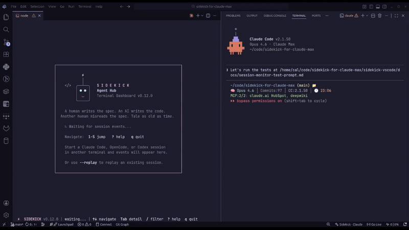
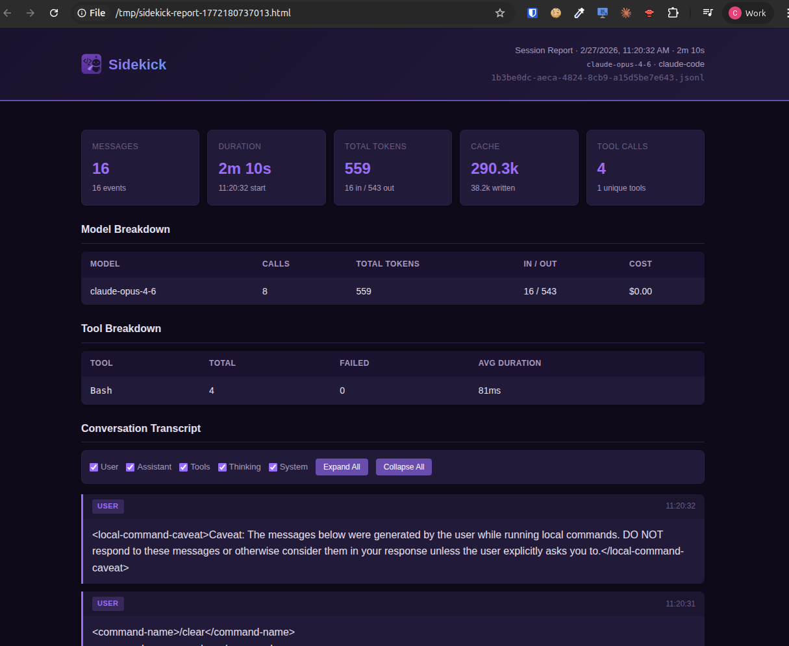
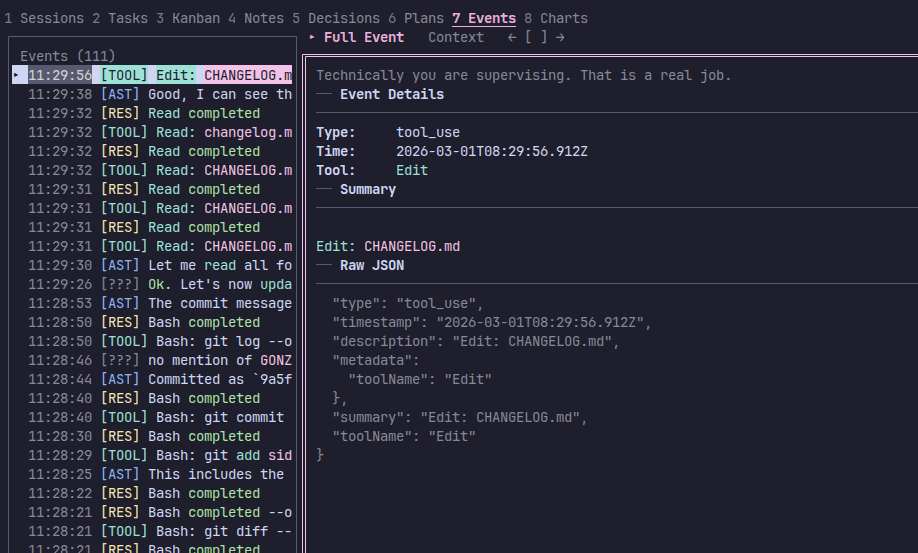
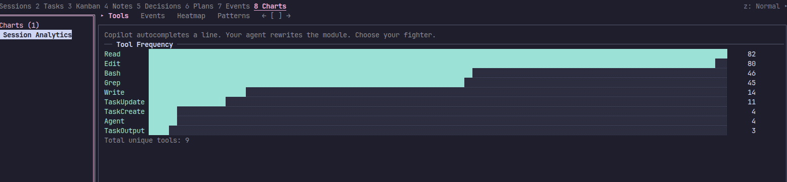

# Sidekick CLI

The Sidekick CLI provides a full-screen terminal dashboard for monitoring agent sessions — standalone, no VS Code required. It reads from the same `~/.config/sidekick/` data files the VS Code extension writes.



!!! warning "Package name vs binary name"
The npm package is `sidekick-agent-hub`, but the binary it installs is called **`sidekick`**. After installation, run `sidekick dashboard` — not `sidekick-agent-hub`.

## Installation

```bash
npm install -g sidekick-agent-hub
```

Requires **Node.js 20+**.

Or build from source:

```bash
bash scripts/build-all.sh
```

This compiles `sidekick-shared` (the data access library) and `sidekick-cli` (the binary). The CLI is output to `sidekick-cli/dist/sidekick-cli.mjs`.

## Quick Start

1. `cd` into your project directory
2. Run `sidekick dashboard`
3. The dashboard auto-detects your project path and session provider
4. Press `?` to see all keybindings

If you have sessions from multiple providers, the most recently active one is selected automatically. Override with `--provider`.

## Command Reference

```bash
sidekick dashboard [options]
```

| Flag               | Description                                                               |
| ------------------ | ------------------------------------------------------------------------- |
| `--project <path>` | Override project path (default: current working directory)                |
| `--provider <id>`  | Session provider: `claude-code`, `opencode`, `codex`, or `auto` (default) |
| `--session <id>`   | Follow a specific session by ID (default: most recent or session picker)  |
| `--replay`         | Replay existing events from the beginning before streaming live           |

### Examples

```bash
# Launch for the current directory
sidekick dashboard

# Monitor a specific project
sidekick dashboard --project ~/code/my-app

# Force Claude Code as the provider
sidekick dashboard --provider claude-code

# Follow a specific session with full replay
sidekick dashboard --session abc123 --replay
```

## Session Dump

```bash
sidekick dump [options]
```

Dump session data as a text timeline, JSON metrics, or markdown report for sharing or archiving.

| Flag             | Description                                            |
| ---------------- | ------------------------------------------------------ |
| `--list`         | List available session IDs for the current project     |
| `--format <fmt>` | Output format: `text` (default), `json`, or `markdown` |
| `--width <cols>` | Terminal width for text output (default: auto-detect)  |
| `--expand`       | Show all events including noise                        |
| `--session <id>` | Target a specific session (default: most recent)       |

Global flags `--project`, `--provider`, and `--json` also apply (see above).

### Examples

```bash
# Dump the latest session as plain text
sidekick dump

# Export as markdown for sharing
sidekick dump --format markdown > session-report.md

# Full JSON export for tooling
sidekick dump --format json > session.json
```

## HTML Report

```bash
sidekick report [options]
```

Generate a self-contained HTML session report and open it in the default browser. Includes full transcript with collapsible thinking blocks and tool detail, token/cost stats, model breakdown, and tool-use summary — zero external dependencies.



| Flag              | Description                                      |
| ----------------- | ------------------------------------------------ |
| `--session <id>`  | Target a specific session (default: most recent) |
| `--output <path>` | Write to a specific file (default: temp file)    |
| `--theme <theme>` | Color theme: `dark` (default) or `light`         |
| `--no-open`       | Write the file without opening the browser       |
| `--no-thinking`   | Omit thinking blocks from the transcript         |

Global flags `--project` and `--provider` also apply (see above).

### Examples

```bash
# Generate report for the latest session and open in browser
sidekick report

# Light theme, save to a specific file
sidekick report --theme light --output ~/reports/session.html

# Generate without opening browser
sidekick report --no-open --output session.html
```

You can also press `r` in the TUI dashboard to generate and open a report for the current session.

## Extract Session Assets

```bash
sidekick extract [options]
```

Extract actionable items from recent Claude Code and Codex chats for exactly the current project directory:

- **URLs** from messages and web/tool inputs
- **File paths** validated against the filesystem, including optional `:line`
- **Commands** the agent presented for you to run in shell snippets or `$`-prefixed lines
- **Plans** from Claude plan mode and Codex finalized `Plan` items

Results are merged across supported agents, sorted by recency, deduped, capped, and grouped by type. Text output labels each item with its source agent (`claude` or `codex`), and JSON output includes `inChat` plus per-item provenance (`agent`, `sessionPath`, and `source`) for downstream tools. The command intentionally uses exact-cwd scoping; it does not walk up or down the directory tree to avoid surfacing another project's chat data.

This feature was contributed by [@B33pBeeps](https://github.com/B33pBeeps) (Juan Fourie) and adapted from his MIT-licensed [`trawl`](https://github.com/B33pBeeps/trawl) project.

| Flag                  | Description                                                                                                       |
| --------------------- | ----------------------------------------------------------------------------------------------------------------- |
| `--type <types>`      | Comma list: `url`, `path`, `command`, `plan` (default: all). Aliases include `urls`, `files`, `cmds`, and `plans` |
| `--limit <n>`         | Positive integer maximum items per type                                                                           |
| `-i`, `--interactive` | Interactive picker; Enter opens URLs and copies paths, commands, or plans                                         |
| `--json`              | Emit grouped JSON for scripting                                                                                   |

Global flags `--project` and `--provider` also apply. `--provider claude-code` reads Claude Code only, `--provider codex` reads Codex only, and `auto` reads both. Invalid `--type` or `--limit` values fail fast with a clear error. OpenCode extraction is not supported yet.

### Examples

```bash
# Grouped text output
sidekick extract

# Only links and file paths
sidekick extract --type url,path

# JSON with at most 10 items of each requested type
sidekick extract --limit 10 --json

# Fuzzy picker with copy/open actions
sidekick extract -i
```

## Data Commands

Standalone commands that query Sidekick's persisted project data without launching the TUI dashboard. All accept the global flags `--project`, `--provider`, and `--json`.

### Tasks

```bash
sidekick tasks [options]
```

List persisted tasks for the current project. Tasks carry over across sessions from `~/.config/sidekick/tasks/`.

| Flag                | Description                                                         |
| ------------------- | ------------------------------------------------------------------- |
| `--status <status>` | Filter by status: `pending`, `completed`, or `all` (default: `all`) |

#### Examples

```bash
# List all tasks
sidekick tasks

# Show only pending tasks
sidekick tasks --status pending

# JSON output for scripting
sidekick tasks --json
```

### Decisions

```bash
sidekick decisions [options]
```

List architectural decisions extracted from sessions. Stored in `~/.config/sidekick/decisions/`.

| Flag               | Description                         |
| ------------------ | ----------------------------------- |
| `--search <query>` | Filter decisions by keyword         |
| `--limit <n>`      | Maximum number of decisions to show |

#### Examples

```bash
# List all decisions
sidekick decisions

# Search for decisions about database choices
sidekick decisions --search "database"

# Show the 5 most recent decisions as JSON
sidekick decisions --limit 5 --json
```

### Notes

```bash
sidekick notes [options]
```

List knowledge notes (gotchas, patterns, guidelines, tips) attached to files in the current project.

| Flag                | Description                                                        |
| ------------------- | ------------------------------------------------------------------ |
| `--file <path>`     | Filter notes by file path                                          |
| `--type <type>`     | Filter by type: `gotcha`, `pattern`, `guideline`, or `tip`         |
| `--status <status>` | Filter by status: `active`, `needs_review`, `stale`, or `obsolete` |

#### Examples

```bash
# List all notes
sidekick notes

# Show only gotchas
sidekick notes --type gotcha

# Notes for a specific file
sidekick notes --file src/services/AuthService.ts

# Active tips as JSON
sidekick notes --type tip --status active --json
```

### Stats

```bash
sidekick stats [options]
```

Show historical usage statistics — tokens, costs, model breakdown, tool usage, and recent daily activity. Reads from `~/.config/sidekick/historical-data.json`. Unknown-model rows render as `—`; any unpriced models encountered are listed in the footer so missing pricing coverage is visible.

No command-specific flags. Use `--json` for machine-readable output.

#### Examples

```bash
# Print a formatted stats summary
sidekick stats

# Export raw historical data as JSON
sidekick stats --json
```

### Status

```bash
sidekick status
```

Check API health for both Claude (status.claude.com) and OpenAI (status.openai.com). Shows indicator with color coding (green = operational, yellow = minor, red = major/critical), affected components, and active incident details with shortlink.

No command-specific flags. Use `--json` for machine-readable output.

#### Examples

```bash
# Check current API status
sidekick status

# Get raw status data as JSON
sidekick status --json
```

When the active provider is `claude-code`, the status output is followed by a **Claude Peak Hours** block pulled from [promoclock.co](https://promoclock.co/) — see [Peak Hours](peak-hours.md) for background.

The dashboard also monitors status automatically, but only for the monitored provider — Claude for Claude Code sessions, OpenAI for Codex sessions, and no provider-status section for OpenCode. When degraded, the status bar shows a colored indicator and the Sessions panel Summary tab shows affected components and incident details.

### Peak

```bash
sidekick peak
```

Show whether Claude is currently in [peak hours](peak-hours.md) (weekdays 13:00–19:00 UTC) when session limits drain faster. Gated on the `claude-code` session provider — when the resolved provider is OpenCode or Codex, the command prints a "not applicable" message instead of calling the upstream endpoint.

Flags: `--provider <id>` (override auto-detected provider: `claude-code`, `opencode`, `codex`, `auto`). Use `--json` for machine-readable output.

```bash
# Human-readable
sidekick peak

# JSON
sidekick peak --json
```

### Quota

```bash
sidekick quota
```

Provider-aware quota and rate-limit display. The command detects the active provider and shows the appropriate data:

- **Claude Code**: Shows Claude Max subscription quota utilization — 5-hour and 7-day windows with color-coded progress bars, projected end-of-window utilization, and reset countdowns. Requires active Claude Code credentials (read from the system Keychain on macOS, or `~/.claude/.credentials.json` on Linux/Windows). JSON output includes `projectedFiveHour` and `projectedSevenDay` fields.
- **Codex**: Shows rate limits extracted from Codex `token_count.rate_limits` events — primary and secondary windows with progress bars, projected end-of-window utilization, and reset countdowns. The default path is local-only: Sidekick checks the current workspace, then recent account-level Codex rollouts, then the account-scoped snapshot cache. Add `--refresh` to explicitly refresh from Codex's usage API before falling back to local data.
- **OpenCode / z.ai**: OpenCode itself provides no native rate-limit data, but when z.ai Coding Plan credentials are available, `sidekick quota --provider opencode` can auto-route to authoritative z.ai quota (5-Hour / Weekly, with projected end-of-window utilization). Use `sidekick quota --provider zai` to request it explicitly.

All providers render in a unified table with aligned `now` (current utilization), `projected` (estimated end-of-window utilization, shown as `—` when it can't be computed), and `resets` columns.

When quota data is unavailable, the command emits structured failure output instead of relying on a generic error string. JSON responses can include `failureKind`, `httpStatus`, and `retryAfterMs` so callers can distinguish auth failures, rate limits, transient network/server failures, and unexpected responses. In the CLI dashboard, the Sessions panel keeps a compact inline quota/rate-limit state visible even when data is unavailable, and quota failure toasts only appear when the failure state changes.

Use `--json` for machine-readable output. For a single-provider Codex check, use `--refresh` to explicitly call the Codex usage API; without it, no Codex quota network request is made. The combined `--all` view is API-first for Codex (see below).

Use `--all` to show Claude and Codex quota together in one run, plus z.ai when available. The providers are fetched in parallel and rendered independently — if one provider's quota is unavailable, its error is shown inline and the others still print (the command never aborts on a single provider's failure). Codex is fetched **API-first** under `--all` (with automatic fallback to local rollouts and the cached snapshot), matching the live Claude and z.ai legs, so the combined view reflects the authoritative aggregate plan quota rather than a possibly-stale local sample. `--all --json` emits a provider-keyed payload.

#### Examples

```bash
# Check current quota utilization (auto-detects provider)
sidekick quota

# Get raw quota data as JSON
sidekick quota --json

# Explicitly check Codex rate limits
sidekick --provider codex quota

# Explicitly refresh Codex rate limits from the usage API
sidekick quota --provider codex --refresh

# Authoritative z.ai Coding Plan quota
sidekick quota --provider zai

# Show Claude, Codex (and z.ai when active) quota side by side
sidekick quota --all

# Combined quota as JSON for automation
sidekick quota --all --json
```

For Claude Max subscriptions, the output also includes a **Peak** line showing whether Claude is currently in peak hours (faster session-limit drain). See [Peak Hours](peak-hours.md).

##### z.ai quota limitations

z.ai quota is read from z.ai's quota API using the token stored by OpenCode, with fallback support for the official plugin's `ANTHROPIC_BASE_URL` and `ANTHROPIC_AUTH_TOKEN` environment variables. z.ai is not a selectable Sidekick inference provider and has no Sidekick account-management surface yet. If the API is unavailable, Sidekick may show a cached z.ai API snapshot, but it no longer estimates account quota from observed local traffic. See the [OpenCode provider guide](../providers/opencode.md#limitations) for the full list.

#### Quota History

```bash
sidekick quota history
```

Renders a 13-week, GitHub-contributions-style heatmap of quota utilization for the current workspace. Each cell is one calendar day; brightness encodes the peak utilization observed that day (≤0% empty, <25% low, <50% mid, <75% high, ≥75% peak). Days that had at least one `available: false` sample render as a red `×`.

| Flag                 | Description                                                                                                                         |
| -------------------- | ----------------------------------------------------------------------------------------------------------------------------------- |
| `--weeks <n>`        | Weeks of history to render (default `13`, clamped 1-26)                                                                             |
| `--provider <id>`    | Limit to a single runtime provider: `claude`, `codex`, or `zai`. Default: all available, in stacked grids                           |
| `--workspace <path>` | Workspace path used to derive the history scope. Default: `process.cwd()`                                                           |
| `--json`             | Emit a `{ workspaceId, weeks, providers: { claude?, codex? }, generatedAt }` payload (same shape consumed by the VS Code dashboard) |

History is sourced from per-workspace JSONL written by both the CLI's quota path and the VS Code extension (Claude via `QuotaService`, Codex via the session provider and `CodexQuotaWatcher`), stored under `~/.config/sidekick/quota-history/<workspaceId>/<provider>.jsonl` with `0600` file permissions, a 60-second per-sample debounce, and a 91-day retention window. The workspace id is `sha256(realpath(workspace))[0..16]` — stable across CLI invocations and VS Code sessions for the same folder.

```bash
# Default — last 13 weeks, both providers
sidekick quota history

# Last 8 weeks, Codex only
sidekick quota history --weeks 8 --provider codex

# JSON for downstream tooling
sidekick quota history --json
```

If no history has accumulated yet for the workspace (or `--workspace`), the command prints a hint pointing at how to seed it (run a Claude Max or Codex session, or pass `--workspace <path>`).

### Account

```bash
sidekick account [options]
```

Manage accounts across providers — save, list, switch, and remove without manual login/logout cycles. Supports Claude Code and Codex profiles. Account data is stored in `~/.config/sidekick/accounts/`.

| Flag                       | Description                                                                                                                                     |
| -------------------------- | ----------------------------------------------------------------------------------------------------------------------------------------------- |
| `--provider <id>`          | Provider: `claude-code` (default), `codex`, or `all`                                                                                            |
| `--add`                    | Save the currently signed-in account                                                                                                            |
| `--login`                  | Sign in and save a **new** account via a provider-isolated login flow that leaves the active account untouched until finalization               |
| `--label <name>`           | Label for the account (required for Codex and `--login`; optional for Claude `--add`)                                                           |
| `--switch`                 | Switch to the next saved account in the list                                                                                                    |
| `--switch-to <id>`         | Switch to a specific account by email, label, or ID                                                                                             |
| `--remove <id>`            | Remove a saved account by email, label, or ID                                                                                                   |
| `--launcher <name>`        | Create an opt-in per-account terminal launcher for the active account                                                                           |
| `--auto-switch <pct\|off>` | Persist the auto-switch quota threshold (`1`–`100`), or `off` to disable. Continuous auto-switching runs in a long-running host such as VS Code |

With no flags, lists all saved accounts and marks the active one. `--provider all` lists Claude and Codex accounts together; with `--json` the output is provider-keyed.

#### Examples

```bash
# List saved accounts (Claude Code, default)
sidekick account

# List Claude and Codex accounts together
sidekick account --provider all

# Save the current Claude Code account with a label
sidekick account --add --label Work

# Sign in and save a NEW account without disturbing the active one
sidekick account --login --label Personal

# Switch to the next account
sidekick account --switch

# Switch to a specific account
sidekick account --switch-to personal@gmail.com

# Remove an account
sidekick account --remove old@example.com

# Auto-switch to a healthier account when quota crosses 90% (off to disable)
sidekick account --auto-switch 90

# Create a per-account terminal launcher
sidekick account --launcher work

# Codex profile management
sidekick account --provider codex                    # list Codex accounts
sidekick account --provider codex --add --label Dev  # prepare profile + login
sidekick account --provider codex --switch-to Dev    # switch by label, email, or ID
sidekick account --provider codex --remove Dev       # remove a profile

# JSON output for scripting
sidekick account --json
```

### Handoff

```bash
sidekick handoff [options]
```

Show the latest session handoff document for the current project. Handoff documents are continuity notes left by an agent at the end of a session.

No command-specific flags. Use `--json` for machine-readable output.

#### Examples

```bash
# Display the latest handoff
sidekick handoff

# Pipe handoff content into another tool
sidekick handoff --json | jq -r '.content'
```

### Search

```bash
sidekick search <query> [options]
```

Full-text search across all sessions. Results include matched snippets with highlighted terms, event types, timestamps, and session/project paths.

| Flag          | Description                             |
| ------------- | --------------------------------------- |
| `--limit <n>` | Maximum number of results (default: 50) |

#### Examples

```bash
# Search for mentions of a function
sidekick search "resolveModel"

# Limit results and output as JSON
sidekick search "database migration" --limit 10 --json

# Search within a specific project
sidekick search "auth bug" --project ~/code/my-app
```

### Context

```bash
sidekick context [options]
```

Output composite project context — tasks, decisions, notes, handoff, stats, and recent sessions in a single document. Useful for piping into LLM prompts or other tools.

| Flag                 | Description                                           |
| -------------------- | ----------------------------------------------------- |
| `--fidelity <level>` | Detail level: `full` (default), `compact`, or `brief` |

#### Examples

```bash
# Full context for the current project
sidekick context

# Compact summary for LLM prompts
sidekick context --fidelity compact

# Brief context as JSON
sidekick context --fidelity brief --json
```

## Dashboard Overview

The dashboard is a two-pane Ink-based terminal UI. The left pane shows a navigable list of items (sessions, tasks, notes, etc.), and the right pane shows details for the selected item.

### Layout Modes

Press `z` to cycle through three layout modes:

| Mode          | Description                                                     |
| ------------- | --------------------------------------------------------------- |
| **Normal**    | Default two-pane split — side list and detail pane side by side |
| **Expanded**  | Side list hidden, detail pane fills the entire screen           |
| **Wide Side** | Wider side list for longer item labels                          |

Minimum terminal size: 60 columns wide, 15 rows tall.

## Dashboard Panels

Switch panels with number keys `1`–`8`.

### Sessions (1)

Browse and select from recent agent sessions. The detail pane has seven tabs:

| Tab            | Description                                                                                                                                                 |
| -------------- | ----------------------------------------------------------------------------------------------------------------------------------------------------------- |
| **Summary**    | Token usage, cost, duration, model, and session metadata                                                                                                    |
| **Timeline**   | Chronological activity feed with tool calls, messages, and events                                                                                           |
| **Mind Map**   | Terminal-rendered graph of session structure — files, tools, tasks, and relationships. Press `v` to cycle views (tree/boxed/flow), `f` to filter node types |
| **Tools**      | Breakdown of tool usage with counts and categories                                                                                                          |
| **Files**      | Files touched during the session                                                                                                                            |
| **Agents**     | Subagent activity and delegation chain                                                                                                                      |
| **AI Summary** | AI-generated narrative of the session. Press `n` to generate                                                                                                |

### Tasks (2)

View persisted tasks filtered by status. Tasks carry over across sessions from `~/.config/sidekick/tasks/`.

### Kanban (3)

Task board with status columns — a visual view of the same task data.

### Notes (4)

Knowledge notes attached to files. Each note has Content and Related detail tabs. Notes persist in `~/.config/sidekick/` and can be injected into agent instruction files.

### Decisions (5)

Architectural decisions extracted from sessions. Stored in `~/.config/sidekick/decisions/`.

### Plans (6)

Discovered agent plans from `~/.claude/plans/`. Shows plan steps with completion status. Plans are matched to the current session via slug cross-reference.

### Events (7)

Live scrollable stream of session events. Each event shows a timestamp, colored type badge (`[USR]`, `[AST]`, `[TOOL]`, `[RES]`), and keyword-highlighted summary text. Events are listed in reverse chronological order with auto-tailing.



The detail pane has two tabs:

| Tab            | Description                                                              |
| -------------- | ------------------------------------------------------------------------ |
| **Full Event** | Event metadata (type, timestamp, tool name) plus the raw JSON payload    |
| **Context**    | Three events before and after the selected event for surrounding context |

### Charts (8)

Session analytics visualized as ASCII charts. The side list shows a single "Session Analytics" item; the detail tabs contain the charts.



| Tab          | Description                                                                                                                         |
| ------------ | ----------------------------------------------------------------------------------------------------------------------------------- |
| **Tools**    | Horizontal bar chart of the top 10 most-used tools with counts                                                                      |
| **Events**   | Event type distribution (user, assistant, tool_use, tool_result) with percentage bars                                               |
| **Heatmap**  | 60-minute rolling activity heatmap using `░▒▓█` intensity characters — one column per minute with peak rate and active minute count |
| **Patterns** | Detected event patterns from template clustering (e.g. `Read src/<*>.ts`) with frequency bars and example summaries                 |

## Keybindings

### Navigation

| Key       | Action                                               |
| --------- | ---------------------------------------------------- |
| `1`–`8`   | Switch panel                                         |
| `Tab`     | Toggle focus between side list and detail pane       |
| `j` / `↓` | Next item (side list) or scroll down (detail pane)   |
| `k` / `↑` | Previous item (side list) or scroll up (detail pane) |
| `g`       | Jump to first item / scroll to top                   |
| `G`       | Jump to last item / scroll to bottom                 |
| `h` / `←` | Return focus to side list (from detail pane)         |
| `Enter`   | Move focus to detail pane (from side list)           |

### Detail Tabs

| Key | Action              |
| --- | ------------------- |
| `[` | Previous detail tab |
| `]` | Next detail tab     |

### Session Management

| Key | Action                                                                |
| --- | --------------------------------------------------------------------- |
| `p` | Pin session — prevent auto-switching to the newest session            |
| `s` | Switch to pending session (when a newer session arrives while pinned) |
| `f` | Toggle session filter — filter the side list to the selected session  |

### Session Panel — Mind Map Tab

| Key | Action                                                                                   |
| --- | ---------------------------------------------------------------------------------------- |
| `v` | Cycle mind map view: tree → boxed → flow                                                 |
| `f` | Cycle node filter: all → file → tool → task → subagent → command → plan → knowledge-note |

### Session Panel — AI Summary Tab

| Key | Action                                         |
| --- | ---------------------------------------------- |
| `n` | Generate or retry AI narrative for the session |

### Actions

| Key | Action                                                                                    |
| --- | ----------------------------------------------------------------------------------------- |
| `r` | Generate HTML report for the current session and open in browser                          |
| `/` | Open filter overlay — supports substring, fuzzy, regex, and date modes (Tab cycles modes) |
| `x` | Open context menu for the selected item                                                   |
| `z` | Cycle layout mode (Normal → Expanded → Wide Side)                                         |

### General

| Key            | Action                                                    |
| -------------- | --------------------------------------------------------- |
| `?`            | Show help overlay                                         |
| `V`            | Show version / changelog                                  |
| `Esc`          | Clear filter, close overlay, or return focus to side list |
| `q` / `Ctrl+C` | Quit (or close overlay if one is open)                    |

## Mouse Support

The dashboard supports mouse input in terminals with SGR 1006 extended mouse encoding (most modern terminals):

- **Click** side list items to select them
- **Click** panel tabs or detail tabs to switch
- **Scroll wheel** in either pane to navigate (scrolls 3 items/lines at a time)
- **Click** anywhere to dismiss overlays (help, filter, context menu)

## Session Management

### Auto-Detection

The CLI auto-detects which session provider is most recently active by checking filesystem presence and modification times:

- **Claude Code** — `~/.claude/projects/`
- **OpenCode** — OpenCode's data directory:
  Linux `~/.local/share/opencode/`, macOS `~/Library/Application Support/opencode/`, Windows `%APPDATA%\\opencode\\`
- **Codex** — `~/.codex/`

Override with `--provider claude-code`, `--provider opencode`, or `--provider codex`.

For OpenCode, the CLI reads `opencode.db` via `sqlite3`. If `sqlite3` is missing or not executable in the current shell environment, the dashboard now prints an actionable OpenCode-specific notice.

### Session Pinning

By default, the dashboard auto-switches to the newest session when one starts. Press `p` to pin the current session — the dashboard stays on it even when new sessions appear. Press `s` to switch to a pending session that arrived while pinned.

### Session Filter

Press `f` to toggle session filtering, which limits the side list to items from the currently selected session. Useful when you have many sessions and want to focus on one.

## Shared Data Layer

The CLI reads from the same `~/.config/sidekick/` directory as the VS Code extension:

| File                                      | Contents                                                                              |
| ----------------------------------------- | ------------------------------------------------------------------------------------- |
| `historical-data.json`                    | Token/cost/tool usage statistics                                                      |
| `tasks/{projectSlug}.json`                | Kanban board task data                                                                |
| `decisions/{projectSlug}.json`            | Decision log entries                                                                  |
| `accounts/accounts.json`                  | Multi-provider account registry (v2)                                                  |
| `accounts/credentials/*.credentials.json` | Backed-up OAuth credentials per Claude account                                        |
| `accounts/configs/*.config.json`          | Backed-up account identity per Claude account                                         |
| `accounts/codex/profiles/*/codex-home/`   | Backed-up credentials per Codex profile (swapped into `~/.codex/auth.json` on switch) |
| `quota-snapshots.json`                    | Cached rate-limit snapshots per provider/account                                      |

Any data written by the VS Code extension is immediately visible in the CLI, and vice versa.

## VS Code Integration

The VS Code extension provides a command to launch the dashboard without leaving the editor:

- **`Sidekick: Open CLI Dashboard`** — opens the TUI dashboard in an integrated terminal panel
