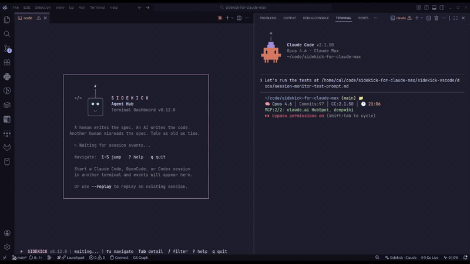
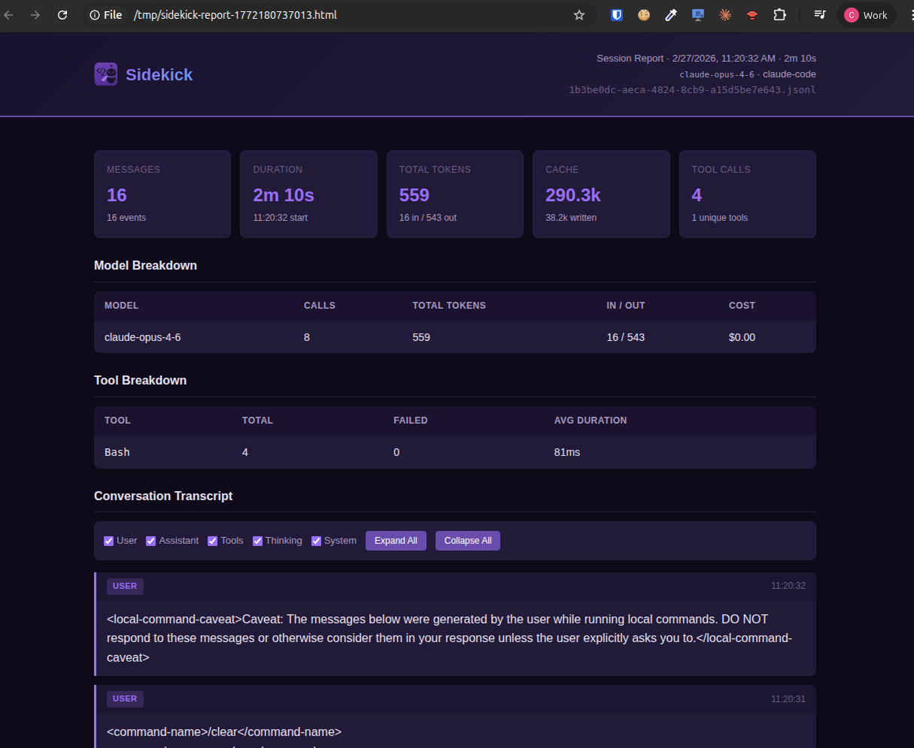
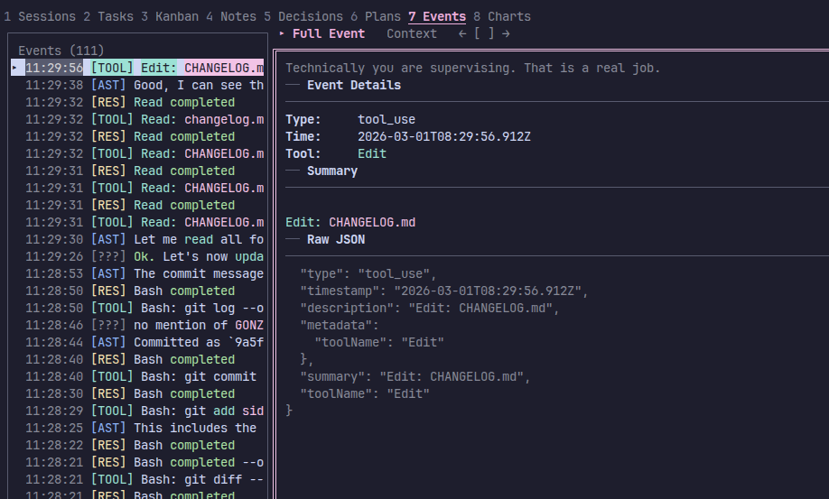
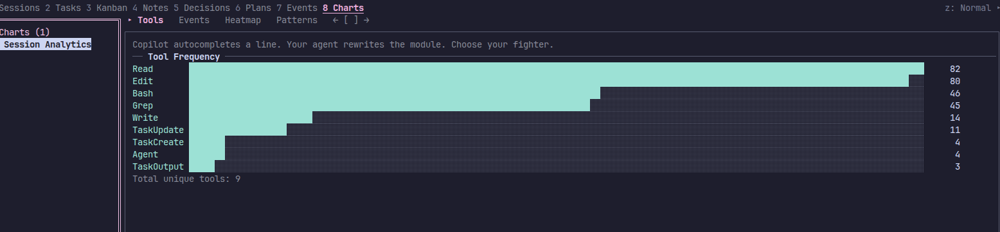

# Sidekick CLI

The Sidekick CLI provides a full-screen terminal dashboard for monitoring agent sessions — standalone, no VS Code required. It reads from the same `~/.config/sidekick/` data files the VS Code extension writes.



!!! warning "Package name vs binary name"
The npm package is `sidekick-agent-hub`, but the binary it installs is called **`sidekick`**. After installation, run `sidekick dashboard` — not `sidekick-agent-hub`.

## Installation

```bash
npm install -g sidekick-agent-hub
```

Requires **Node.js 20+**.

Or build from source:

```bash
bash scripts/build-all.sh
```

This compiles `sidekick-shared` (the data access library) and `sidekick-cli` (the binary). The CLI is output to `sidekick-cli/dist/sidekick-cli.mjs`.

## Quick Start

1. `cd` into your project directory
2. Run `sidekick dashboard`
3. The dashboard auto-detects your project path and session provider
4. Press `?` to see all keybindings

If you have sessions from multiple providers, the most recently active one is selected automatically. Override with `--provider`.

## Command Reference

```bash
sidekick dashboard [options]
```

| Flag                   | Description                                                                                       |
| ---------------------- | ------------------------------------------------------------------------------------------------- |
| `--project <path>`     | Override project path (default: current working directory)                                        |
| `--provider <id>`      | Session provider: `claude-code`, `opencode`, `codex`, or `auto` (default)                         |
| `--session <id>`       | Follow a specific session by ID (default: most recent or session picker)                          |
| `--replay`             | Replay existing events from the beginning before streaming live                                   |
| `--no-mouse`           | Start with mouse capture disabled so terminal text selection works (toggle with `M`)              |
| `--no-color`           | Disable colored output for any command (also honors `NO_COLOR`)                                   |
| `--offline`            | Price from the cached catalog only; never refresh it over the network (also `SIDEKICK_OFFLINE=1`) |
| `--output-file <path>` | Write everything a command prints to stdout into a file (not for `dashboard` or `mcp`)            |

### Examples

```bash
# Launch for the current directory
sidekick dashboard

# Monitor a specific project
sidekick dashboard --project ~/code/my-app

# Force Claude Code as the provider
sidekick dashboard --provider claude-code

# Follow a specific session with full replay
sidekick dashboard --session abc123 --replay
```

## Session Dump

```bash
sidekick dump [options]
```

Dump session data as a text timeline, JSON metrics, or markdown report for sharing or archiving.

| Flag             | Description                                            |
| ---------------- | ------------------------------------------------------ |
| `--list`         | List available session IDs for the current project     |
| `--csv`          | With `--list`, print the session table as CSV          |
| `--limit <n>`    | Maximum sessions listed with `--list` (default: 50)    |
| `--format <fmt>` | Output format: `text` (default), `json`, or `markdown` |
| `--width <cols>` | Terminal width for text output (default: auto-detect)  |
| `--expand`       | Show all events including noise                        |
| `--session <id>` | Target a specific session (default: most recent)       |

Global flags `--project`, `--provider`, and `--json` also apply (see above); `--json` on a non-list dump is the same as `--format json`. Token totals count every billed bucket (input, output, cache writes, and cache reads) and cost figures name their provenance (provider-reported or estimated from catalog pricing).

### Examples

```bash
# Dump the latest session as plain text
sidekick dump

# Export as markdown for sharing
sidekick dump --format markdown > session-report.md

# Full JSON export for tooling
sidekick dump --format json > session.json
```

## Prompt History

```bash
sidekick history [options]
```

Show recent user prompts across Codex sessions, newest first — a quick answer to "what was I working on?" that spans every workspace. Not to be confused with `sidekick quota history`, the quota utilization heatmap.

| Flag                 | Description                                                  |
| -------------------- | ------------------------------------------------------------ |
| `--limit <n>`        | Maximum prompts to show (default: 20)                        |
| `--path <sessionId>` | Print the rollout transcript path for a session ID or prefix |

The global `--json` flag emits machine-readable entries with full session IDs and ISO timestamps. The global `--project` and `--provider` filters do not apply: history is cross-workspace and Codex-only.

Codex-only for now: Codex records every prompt in a global `~/.codex/history.jsonl`, which is what this command reads. Claude Code and OpenCode keep prompts inside per-session files and are not yet supported.

### Examples

```bash
# The twenty most recent prompts
sidekick history

# Jump to a session's transcript file
less "$(sidekick history --path 0198a3c2)"

# Machine-readable entries
sidekick history --json | jq '.[0]'
```

## HTML Report

```bash
sidekick report [options]
```

Generate a self-contained HTML session report and open it in the default browser. Includes full transcript with collapsible thinking blocks and tool detail, token/cost stats, model breakdown, and tool-use summary — zero external dependencies.



| Flag              | Description                                      |
| ----------------- | ------------------------------------------------ |
| `--session <id>`  | Target a specific session (default: most recent) |
| `--output <path>` | Write to a specific file (default: temp file)    |
| `--theme <theme>` | Color theme: `dark` (default) or `light`         |
| `--no-open`       | Write the file without opening the browser       |
| `--no-thinking`   | Omit thinking blocks from the transcript         |

Global flags `--project` and `--provider` also apply (see above). With the global `--json` flag the command prints `{ "path", "sessionPath", "sessionFileName", "bytes" }` to stdout instead of the "Report written to" note.

### Examples

```bash
# Generate report for the latest session and open in browser
sidekick report

# Light theme, save to a specific file
sidekick report --theme light --output ~/reports/session.html

# Generate without opening browser
sidekick report --no-open --output session.html
```

You can also press `r` in the TUI dashboard to generate and open a report for the current session.

## Extract Session Assets

```bash
sidekick extract [options]
```

Extract actionable items from recent Claude Code and Codex chats for exactly the current project directory:

- **URLs** from messages and web/tool inputs
- **File paths** validated against the filesystem, including optional `:line`
- **Commands** the agent presented for you to run in shell snippets or `$`-prefixed lines
- **Plans** from Claude plan mode and Codex finalized `Plan` items

Results are merged across supported agents, sorted by recency, deduped, capped, and grouped by type. Text output labels each item with its source agent (`claude` or `codex`), and JSON output includes `inChat` plus per-item provenance (`agent`, `sessionPath`, and `source`) for downstream tools. The command intentionally uses exact-cwd scoping; it does not walk up or down the directory tree to avoid surfacing another project's chat data.

This feature was contributed by [@B33pBeeps](https://github.com/B33pBeeps) (Juan Fourie) and adapted from his MIT-licensed [`trawl`](https://github.com/B33pBeeps/trawl) project.

| Flag                  | Description                                                                                                       |
| --------------------- | ----------------------------------------------------------------------------------------------------------------- |
| `--type <types>`      | Comma list: `url`, `path`, `command`, `plan` (default: all). Aliases include `urls`, `files`, `cmds`, and `plans` |
| `--limit <n>`         | Positive integer maximum items per type                                                                           |
| `-i`, `--interactive` | Interactive picker; Enter opens URLs and copies paths, commands, or plans                                         |
| `--json`              | Emit grouped JSON for scripting; cannot be combined with `-i`                                                     |

Global flags `--project` and `--provider` also apply. `--provider claude-code` reads Claude Code only, `--provider codex` reads Codex only, and `auto` reads both. Invalid `--type` or `--limit` values fail fast with a clear error. OpenCode extraction is not supported yet.

### Examples

```bash
# Grouped text output
sidekick extract

# Only links and file paths
sidekick extract --type url,path

# JSON with at most 10 items of each requested type
sidekick extract --limit 10 --json

# Fuzzy picker with copy/open actions
sidekick extract -i
```

## Data Commands

Standalone commands that query Sidekick's persisted project data without launching the TUI dashboard. All accept the global flags `--project`, `--provider`, and `--json`.

### Daily brief and diagnostics

```bash
sidekick today       # cache-only yesterday/tasks/decision/handoff/quota brief
sidekick doctor      # diagnose project, session, account, provider, and dependency health
sidekick statusline  # fast one-line account/quota/burn-rate footer
```

`today` and `statusline` bypass account bootstrap, pricing hydration, and quota network calls. Use `Sidekick: Install Statusline` in VS Code to merge the status-line command into Claude Code settings; uninstalling it restores the previous block.

When Claude Code runs `sidekick statusline` as its status line it pipes a JSON document on stdin. Sidekick reads it and appends context usage, session cost, and prompt-cache hit rate to the line, and — for Claude.ai Pro and Max subscribers — writes the **official** five-hour and seven-day rate limits into the quota snapshot and history stores. Every other command and both dashboards then see authoritative quota without a network call. Cached quota older than five minutes is labelled with its age. Set `SIDEKICK_STATUSLINE_STDIN=0` to ignore stdin.

```
acct:work · 5h 42% resets 14:00 · ~1h20m left · 7d 61% · ctx 37% · $0.42 · cache 93%
```

### Quick capture

```bash
sidekick tasks add "Investigate retry spike"
sidekick tasks done <task-id>
sidekick note add "Migration requires a cache clear" --type gotcha
sidekick decision add "Use SQLite" --rationale "Local and portable"
```

Capture commands atomically merge with the same per-project stores used by VS Code. An open Kanban board refreshes when a CLI write lands, without restarting the extension. With the global `--json` flag each capture command prints the stored record (`{ ok, action, task | note | decision }`) instead of a sentence.

### External handoff

```bash
sidekick handoff open \
  --url-template 'mytool://session/{sessionId}?provider={provider}' \
  --session <session-id>
```

Templates accept identifiers only: `{sessionId}`, `{provider}`, and `{projectPath}`. Use `--no-open` to print the rendered URL. VS Code exposes the same behavior through `sidekick.handoffUrlTemplate` and **Sidekick: Open External Session Handoff**.

### MCP facts server

`sidekick mcp` serves seven read-only facts tools to Claude Code or Codex. See [MCP Facts Server](mcp.md) for registration and the complete tool list.

### Tasks

```bash
sidekick tasks [options]
```

List persisted tasks for the current project. Tasks carry over across sessions from `~/.config/sidekick/tasks/`.

| Flag                | Description                                                         |
| ------------------- | ------------------------------------------------------------------- |
| `--status <status>` | Filter by status: `pending`, `completed`, or `all` (default: `all`) |

#### Examples

```bash
# List all tasks
sidekick tasks

# Show only pending tasks
sidekick tasks --status pending

# JSON output for scripting
sidekick tasks --json
```

### Decisions

```bash
sidekick decisions [options]
```

List architectural decisions extracted from sessions. Stored in `~/.config/sidekick/decisions/`.

| Flag               | Description                         |
| ------------------ | ----------------------------------- |
| `--search <query>` | Filter decisions by keyword         |
| `--limit <n>`      | Maximum number of decisions to show |

#### Examples

```bash
# List all decisions
sidekick decisions

# Search for decisions about database choices
sidekick decisions --search "database"

# Show the 5 most recent decisions as JSON
sidekick decisions --limit 5 --json
```

### Notes

```bash
sidekick notes [options]
```

List knowledge notes (gotchas, patterns, guidelines, tips) attached to files in the current project.

| Flag                | Description                                                        |
| ------------------- | ------------------------------------------------------------------ |
| `--file <path>`     | Filter notes by file path                                          |
| `--type <type>`     | Filter by type: `gotcha`, `pattern`, `guideline`, or `tip`         |
| `--status <status>` | Filter by status: `active`, `needs_review`, `stale`, or `obsolete` |

#### Examples

```bash
# List all notes
sidekick notes

# Show only gotchas
sidekick notes --type gotcha

# Notes for a specific file
sidekick notes --file src/services/AuthService.ts

# Active tips as JSON
sidekick notes --type tip --status active --json
```

### Stats

```bash
sidekick stats [options]
```

Show historical usage statistics — tokens, costs, model breakdown, tool usage, and recent daily activity. Reads from `~/.config/sidekick/historical-data.json`, which the VS Code extension writes as sessions end and `sidekick import` backfills from session logs (see below); for reports computed straight from the logs, use `sidekick daily` and friends. Unknown-model rows render as `—`; any unpriced models encountered are listed in the footer so missing pricing coverage is visible. "Total (incl. cache)" counts input, output, cache writes, and cache reads — the same total every other Sidekick surface shows.

| Flag    | Description                                                                                            |
| ------- | ------------------------------------------------------------------------------------------------------ |
| `--csv` | Print every recorded day as CSV: date, sessions, messages, token buckets, total, cost, unpriced models |

Use the global `--json` for the raw store.

#### Examples

```bash
# Print a formatted stats summary
sidekick stats

# Export raw historical data as JSON
sidekick stats --json

# Every recorded day as CSV, straight into a spreadsheet
sidekick stats --csv --output-file usage.csv
```

### Import

```bash
sidekick import [--since <time>]
```

Fold every finished session from every provider with session data (Claude Code, Codex, and OpenCode; the global `--provider` narrows to one) into the history store behind `sidekick stats`, `sidekick today`, and the VS Code History tab. Each session is read once through the same unified stats path the extension uses, so both hosts credit sessions identically: cache-inclusive per-model totals, cost with unpriced markers, and a tool success/failure split. The import is idempotent — files already imported, sessions already persisted by the live monitor, and files modified in the last minute are skipped — and the store is written in one short locked update that re-checks the on-disk state, so a concurrent extension write is never overwritten. Use `--since` (ISO date, `YYYY-MM-DD`, or a relative window such as `30d`) to limit the scan, and the global `--json` for the result (`sessionsImported`, `filesSkipped`, `filesUnavailable`, and so on).

### Billing blocks

```bash
sidekick blocks [--active | --recent | --since <time>] [--csv]
```

Five-hour billing blocks computed straight from session logs, for the auto-detected or `--provider` session provider. A block opens at the first usage event (aligned down to the UTC hour, as ccusage does), lasts five hours, and a gap longer than five hours or an event past the block's end opens a new one. Each row shows the block's cache-inclusive token total, cost, burn rate (tokens per minute over the block so far), and — for the block that is still open — the projected end-of-block tokens and cost and the time remaining.

Session logs are read once and cached under `~/.config/sidekick/usage-cache/` by size and modification time, so repeat runs only re-read sessions that changed; `--no-cache` forces a full re-read. The table is a **local estimate**. When `sidekick statusline` has persisted an official rate-limit sample from Claude Code, it is printed beneath the table as `Official (status line)` with its age so the two can be compared.

| Flag             | Description                                                                                |
| ---------------- | ------------------------------------------------------------------------------------------ |
| `--active`       | Only the block that is open right now (or a note that none is)                             |
| `--recent`       | Blocks from the last three days (default)                                                  |
| `--since <time>` | Blocks since an ISO date, `YYYY-MM-DD`, or a relative window such as `7d`, `24h`, or `90m` |
| `--csv`          | One row per block: window, status, token buckets, cost, provenance, burn, projection       |
| `--no-cache`     | Re-read every session instead of using the usage cache                                     |

Use the global `--json` for the full report (`blocks`, `active`, `official`, session and cache counts).

#### Examples

```bash
# The block that is open now, with its burn rate and projection
sidekick blocks --active

# A week of Codex blocks as CSV
sidekick --provider codex blocks --since 7d --csv

# Feed a status bar or script
sidekick blocks --active --json
```

### Usage reports

```bash
sidekick daily   [--since <time>] [--until <time>] [--breakdown] [--by-project] [--utc] [--csv]
sidekick weekly  [...]
sidekick monthly [...]
sidekick sessions [...]
```

Usage computed straight from session logs, so they work for CLI-only users who never ran the VS Code extension (the store-backed `sidekick stats` still needs the extension's history). By default every provider with session data is read and shown side by side — Claude Code, Codex, and OpenCode in one table — and the global `--provider` restricts the report to one.

Rows are bucketed by the **time of each usage event**, on the local calendar unless `--utc`, so a session that crosses midnight is split across the days it actually ran in (the history store behind `stats` buckets by session start instead). Weeks start on Monday. `sessions` prints one row per session with its first event, project, calls, cache-inclusive total, cost, and models. Sessions are read once and cached under `~/.config/sidekick/usage-cache/` by size and modification time.

| Flag             | Description                                                                                                                                       |
| ---------------- | ------------------------------------------------------------------------------------------------------------------------------------------------- |
| `--since <time>` | Window start: ISO date, `YYYY-MM-DD`, or a relative window such as `30d`, `12w`, `24h` (defaults: 30 days, 12 weeks, 12 calendar months, 30 days) |
| `--until <time>` | Window end (default: now)                                                                                                                         |
| `--breakdown`    | Per-model sub-rows under every row                                                                                                                |
| `--by-project`   | Group rows by project as well as provider                                                                                                         |
| `--utc`          | Bucket by UTC calendar days instead of local days                                                                                                 |
| `--csv`          | One row per bucket (and per breakdown sub-row): period, provider, project, model, token buckets, total, cost, provenance                          |
| `--no-cache`     | Re-read every session instead of using the usage cache                                                                                            |

Column labels follow the shared vocabulary ("Total (incl. cache)"); costs carry their provenance in the footer and unpriced rows show `—`. Use the global `--json` for the full report (`rows`, `breakdown`, `totals`, providers, and cache counts).

#### Examples

```bash
# Last 30 days, every provider, one row per day
sidekick daily

# Per-model sub-rows, Codex only, keyed by UTC day
sidekick --provider codex daily --breakdown --utc

# A quarter of weeks as CSV
sidekick weekly --since 13w --csv --output-file weeks.csv

# Every session from the last day, for scripts
sidekick sessions --since 24h --json
```

### Status

```bash
sidekick status
```

Check API health for both Claude (status.claude.com) and OpenAI (status.openai.com). Shows indicator with color coding (green = operational, yellow = minor, red = major/critical), affected components, and active incident details with shortlink.

No command-specific flags. Use `--json` for machine-readable output.

#### Examples

```bash
# Check current API status
sidekick status

# Get raw status data as JSON
sidekick status --json
```

When the active provider is `claude-code`, the status output is followed by a **Claude Peak Hours** block pulled from [promoclock.co](https://promoclock.co/) — see [Peak Hours](peak-hours.md) for background.

The dashboard also monitors status automatically, but only for the monitored provider — Claude for Claude Code sessions, OpenAI for Codex sessions, and no provider-status section for OpenCode. When degraded, the status bar shows a colored indicator and the Sessions panel Summary tab shows affected components and incident details.

### Peak

```bash
sidekick peak
```

Show whether Claude is currently in [peak hours](peak-hours.md) (weekdays 13:00–19:00 UTC) when session limits drain faster. Gated on the `claude-code` session provider — when the resolved provider is OpenCode or Codex, the command prints a "not applicable" message instead of calling the upstream endpoint.

Flags: `--provider <id>` (override auto-detected provider: `claude-code`, `opencode`, `codex`, `auto`). Use `--json` for machine-readable output.

```bash
# Human-readable
sidekick peak

# JSON
sidekick peak --json
```

### Quota

```bash
sidekick quota
```

Provider-aware quota and rate-limit display. The command detects the active provider and shows the appropriate data:

- **Claude Code**: Shows Claude Max subscription quota utilization — 5-hour and 7-day windows with color-coded progress bars, projected end-of-window utilization, and reset countdowns. Requires active Claude Code credentials (read from the system Keychain on macOS, or `~/.claude/.credentials.json` on Linux/Windows). JSON output includes `projectedFiveHour` and `projectedSevenDay` fields.
- **Codex**: Shows rate limits extracted from Codex `token_count.rate_limits` events — primary and secondary windows with progress bars, projected end-of-window utilization, and reset countdowns. Session logs (the current workspace's rollouts, then recent account-level rollouts) are the session-derived step of the shared precedence described below. When quota comes from the API, the output also lists any available **reset credits** — a `Reset Credits: N available` line plus each credit's expiration.
- **OpenCode / z.ai**: OpenCode itself provides no native rate-limit data, but when z.ai Coding Plan credentials are available, `sidekick quota --provider opencode` can auto-route to authoritative z.ai quota (5-Hour / Weekly, with projected end-of-window utilization). Use `sidekick quota --provider zai` to request it explicitly.

All providers render in a unified table with aligned `now` (current utilization), `projected` (estimated end-of-window utilization, shown as `—` when it can't be computed), and `resets` columns.

When quota data is unavailable, the command emits structured failure output instead of relying on a generic error string. JSON responses can include `failureKind`, `httpStatus`, and `retryAfterMs` so callers can distinguish auth failures, rate limits, transient network/server failures, and unexpected responses. In the CLI dashboard, the Sessions panel keeps a compact inline quota/rate-limit state visible even when data is unavailable, and quota failure toasts only appear when the failure state changes.

Every provider — and `sidekick quota --all`, the MCP `get_quota_status` tool, and both dashboards — resolves quota through one shared path with one precedence:

1. A persisted sample younger than five minutes: the official status-line sample written by `sidekick statusline`, a session-log sample, or an earlier API answer. No network call is made.
2. Session logs (Codex rollouts carry rate limits; Claude and z.ai have no local equivalent).
3. The provider API. Its answer is persisted for the next command.
4. The most recent older sample, labelled with its age.

The `Source` row names which step produced the numbers — `cached status-line sample from … (3m ago)`, `local session logs`, `Anthropic usage API`, and so on — and turns yellow when the sample is older than five minutes. Add `--refresh` to skip step 1 and ask the API first. Use `--json` for machine-readable output; the payload includes `resolution` (`snapshot-fresh`, `session`, `api`, `snapshot-aging`, `snapshot-stale`, or `unavailable`), `source`, `capturedSource`, `freshness`, and `ageMs`.

Use `--all` to show Claude and Codex quota together in one run, plus z.ai when available. The providers are resolved in parallel with the same precedence as the single-provider view, so the two can never disagree, and rendered independently — if one provider's quota is unavailable, its error is shown inline and the others still print (the command never aborts on a single provider's failure). `--all --json` emits a provider-keyed payload.

#### Examples

```bash
# Check current quota utilization (auto-detects provider)
sidekick quota

# Get raw quota data as JSON
sidekick quota --json

# Explicitly check Codex rate limits
sidekick --provider codex quota

# Ask the provider API first instead of reusing a fresh local sample
sidekick quota --provider codex --refresh

# Authoritative z.ai Coding Plan quota
sidekick quota --provider zai

# Show Claude, Codex (and z.ai when active) quota side by side
sidekick quota --all

# Combined quota as JSON for automation
sidekick quota --all --json
```

For Claude Max subscriptions, the output also includes a **Peak** line showing whether Claude is currently in peak hours (faster session-limit drain). See [Peak Hours](peak-hours.md).

##### z.ai quota limitations

z.ai quota is read from z.ai's quota API using the token stored by OpenCode, with fallback support for the official plugin's `ANTHROPIC_BASE_URL` and `ANTHROPIC_AUTH_TOKEN` environment variables. z.ai is not a selectable Sidekick inference provider and has no Sidekick account-management surface yet. If the API is unavailable, Sidekick may show a cached z.ai API snapshot, but it no longer estimates account quota from observed local traffic. See the [OpenCode provider guide](../providers/opencode.md#limitations) for the full list.

#### Quota History

```bash
sidekick quota history
```

Renders a 13-week, GitHub-contributions-style heatmap of quota utilization for the current workspace. Each cell is one local calendar day; brightness encodes the peak utilization of the selected window observed that day (≤0% empty, <25% low, <50% mid, <75% high, ≥75% peak). Days that had at least one `available: false` sample render as a red `×`.

| Flag                 | Description                                                                                                                                 |
| -------------------- | ------------------------------------------------------------------------------------------------------------------------------------------- |
| `--weeks <n>`        | Weeks of history to render (default `13`, clamped 1-26)                                                                                     |
| `--provider <id>`    | Limit to a single runtime provider: `claude`, `codex`, or `zai`. Default: all available, in stacked grids                                   |
| `--workspace <path>` | Workspace path used to derive the history scope. Default: `process.cwd()`                                                                   |
| `--window <window>`  | Which limit the cells show: `5h` (default), `7d`, or `max` (the higher of the two, the previous behaviour)                                  |
| `--csv`              | Print the daily buckets (date, provider, samples, max/avg for both windows, unavailable) as CSV                                             |
| `--json`             | Emit a `{ workspaceId, weeks, window, providers: { claude?, codex? }, generatedAt }` payload (same shape consumed by the VS Code dashboard) |

History is sourced from per-workspace JSONL written by both the CLI's quota path and the VS Code extension (Claude via `QuotaService`, Codex via the session provider and `CodexQuotaWatcher`), stored under `~/.config/sidekick/quota-history/<workspaceId>/<provider>.jsonl` with `0600` file permissions, a 60-second per-sample debounce, and a 91-day retention window. The workspace id is `sha256(realpath(workspace))[0..16]` — stable across CLI invocations and VS Code sessions for the same folder.

```bash
# Default — last 13 weeks, both providers
sidekick quota history

# Last 8 weeks, Codex only
sidekick quota history --weeks 8 --provider codex

# JSON for downstream tooling
sidekick quota history --json
```

If no history has accumulated yet for the workspace (or `--workspace`), the command prints a hint pointing at how to seed it (run a Claude Max or Codex session, or pass `--workspace <path>`).

### Account

```bash
sidekick account [options]
```

Manage accounts across providers — save, list, switch, and remove without manual login/logout cycles. Supports Claude Code and Codex profiles. Account data is stored in `~/.config/sidekick/accounts/`.

| Flag                       | Description                                                                                                                                     |
| -------------------------- | ----------------------------------------------------------------------------------------------------------------------------------------------- |
| `--provider <id>`          | Provider: `claude-code` (default), `codex`, or `all`                                                                                            |
| `--add`                    | Save the currently signed-in account                                                                                                            |
| `--login`                  | Sign in and save a **new** account via a provider-isolated login flow that leaves the active account untouched until finalization               |
| `--label <name>`           | Label for the account (required for Codex and `--login`; optional for Claude `--add`)                                                           |
| `--switch`                 | Switch to the next saved account in the list                                                                                                    |
| `--switch-to <id>`         | Switch to a specific account by email, label, or ID                                                                                             |
| `--remove <id>`            | Remove a saved account by email, label, or ID (prompts for y/N confirmation first)                                                              |
| `-y`, `--yes` / `--force`  | Skip the `--remove` confirmation prompt (required for `--json` or non-interactive runs)                                                         |
| `--launcher <name>`        | Create an opt-in per-account terminal launcher for the active account                                                                           |
| `--auto-switch <pct\|off>` | Persist the auto-switch quota threshold (`1`–`100`), or `off` to disable. Continuous auto-switching runs in a long-running host such as VS Code |

With no flags, lists all saved accounts and marks the active one. `--provider all` lists Claude and Codex accounts together; with `--json` the output is provider-keyed.

`--remove` prints the resolved account and asks for an interactive y/N answer (default No). Pass `-y`/`--yes` (or `--force`) to skip the prompt; `--json` and non-TTY contexts require the flag and exit `1` without it — unattended automation that removes accounts must add `--yes`.

#### Examples

```bash
# List saved accounts (Claude Code, default)
sidekick account

# List Claude and Codex accounts together
sidekick account --provider all

# Save the current Claude Code account with a label
sidekick account --add --label Work

# Sign in and save a NEW account without disturbing the active one
sidekick account --login --label Personal

# Switch to the next account
sidekick account --switch

# Switch to a specific account
sidekick account --switch-to personal@gmail.com

# Remove an account
sidekick account --remove old@example.com

# Auto-switch to a healthier account when quota crosses 90% (off to disable)
sidekick account --auto-switch 90

# Create a per-account terminal launcher
sidekick account --launcher work

# Codex profile management
sidekick account --provider codex                    # list Codex accounts
sidekick account --provider codex --add --label Dev  # prepare profile + login
sidekick account --provider codex --switch-to Dev    # switch by label, email, or ID
sidekick account --provider codex --remove Dev       # remove a profile

# JSON output for scripting
sidekick account --json
```

### Handoff

```bash
sidekick handoff [options]
```

Show the latest session handoff document for the current project. Handoff documents are continuity notes left by an agent at the end of a session.

The base command has no flags of its own — use `--json` for machine-readable output. The `handoff open` subcommand accepts `--url-template <template>`, `--session <id>`, and `--no-open`; see [External handoff](#external-handoff).

#### Examples

```bash
# Display the latest handoff
sidekick handoff

# Pipe handoff content into another tool
sidekick handoff --json | jq -r '.content'
```

### Search

```bash
sidekick search <query> [options]
```

Full-text search across all sessions. Results include matched snippets with highlighted terms, event types, timestamps, and session/project paths.

| Flag          | Description                             |
| ------------- | --------------------------------------- |
| `--limit <n>` | Maximum number of results (default: 50) |

#### Examples

```bash
# Search for mentions of a function
sidekick search "resolveModel"

# Limit results and output as JSON
sidekick search "database migration" --limit 10 --json

# Search within a specific project
sidekick search "auth bug" --project ~/code/my-app
```

### Context

```bash
sidekick context [options]
```

Output composite project context — tasks, decisions, notes, handoff, stats, and recent sessions in a single document. Useful for piping into LLM prompts or other tools.

| Flag                 | Description                                           |
| -------------------- | ----------------------------------------------------- |
| `--fidelity <level>` | Detail level: `full` (default), `compact`, or `brief` |

#### Examples

```bash
# Full context for the current project
sidekick context

# Compact summary for LLM prompts
sidekick context --fidelity compact

# Brief context as JSON
sidekick context --fidelity brief --json
```

## Dashboard Overview

The dashboard is a two-pane Ink-based terminal UI. The left pane shows a navigable list of items (sessions, tasks, notes, etc.), and the right pane shows details for the selected item.

### Layout Modes

Press `z` to cycle through three layout modes:

| Mode          | Description                                                     |
| ------------- | --------------------------------------------------------------- |
| **Normal**    | Default two-pane split — side list and detail pane side by side |
| **Expanded**  | Side list hidden, detail pane fills the entire screen           |
| **Wide Side** | Wider side list for longer item labels                          |

Minimum terminal size: 60 columns wide, 15 rows tall.

## Dashboard Panels

Switch panels with number keys `1`–`8`.

### Sessions (1)

Browse and select from recent agent sessions. The detail pane has seven tabs:

| Tab            | Description                                                                                                                                                      |
| -------------- | ---------------------------------------------------------------------------------------------------------------------------------------------------------------- |
| **Summary**    | Token usage, cost, duration, model, session metadata, quota, and the active five-hour billing block (a local estimate from session logs, refreshed every minute) |
| **Timeline**   | Chronological activity feed with tool calls, messages, and events                                                                                                |
| **Mind Map**   | Terminal-rendered graph of session structure — files, tools, tasks, and relationships. Press `v` to cycle views (tree/boxed/flow), `F` to filter node types      |
| **Tools**      | Breakdown of tool usage with counts and categories                                                                                                               |
| **Files**      | Files touched during the session                                                                                                                                 |
| **Agents**     | Subagent activity and delegation chain                                                                                                                           |
| **AI Summary** | AI-generated narrative of the session. Press `n` to generate                                                                                                     |

### Tasks (2)

View persisted tasks filtered by status. Tasks carry over across sessions from `~/.config/sidekick/tasks/`.

### Kanban (3)

Task board with status columns — a visual view of the same task data.

### Notes (4)

Knowledge notes attached to files. Each note has Content and Related detail tabs. Notes persist in `~/.config/sidekick/` and can be injected into agent instruction files.

### Decisions (5)

Architectural decisions extracted from sessions. Stored in `~/.config/sidekick/decisions/`.

### Plans (6)

Discovered agent plans from `~/.claude/plans/`. Shows plan steps with completion status. Plans are matched to the current session via slug cross-reference.

### Events (7)

Live scrollable stream of session events. Each event shows a timestamp, colored type badge (`[USR]`, `[AST]`, `[TOOL]`, `[RES]`), and keyword-highlighted summary text. Events are listed in reverse chronological order with auto-tailing.



The detail pane has two tabs:

| Tab            | Description                                                              |
| -------------- | ------------------------------------------------------------------------ |
| **Full Event** | Event metadata (type, timestamp, tool name) plus the raw JSON payload    |
| **Context**    | Three events before and after the selected event for surrounding context |

### Charts (8)

Session analytics visualized as ASCII charts. The side list shows a single "Session Analytics" item; the detail tabs contain the charts.



| Tab          | Description                                                                                                                         |
| ------------ | ----------------------------------------------------------------------------------------------------------------------------------- |
| **Tools**    | Horizontal bar chart of the top 10 most-used tools with counts                                                                      |
| **Events**   | Event type distribution (user, assistant, tool_use, tool_result) with percentage bars                                               |
| **Heatmap**  | 60-minute rolling activity heatmap using `░▒▓█` intensity characters — one column per minute with peak rate and active minute count |
| **Patterns** | Detected event patterns from template clustering (e.g. `Read src/<*>.ts`) with frequency bars and example summaries                 |

## Keybindings

### Navigation

| Key       | Action                                               |
| --------- | ---------------------------------------------------- |
| `1`–`8`   | Switch panel                                         |
| `Tab`     | Toggle focus between side list and detail pane       |
| `j` / `↓` | Next item (side list) or scroll down (detail pane)   |
| `k` / `↑` | Previous item (side list) or scroll up (detail pane) |
| `g`       | Jump to first item / scroll to top                   |
| `G`       | Jump to last item / scroll to bottom                 |
| `h` / `←` | Return focus to side list (from detail pane)         |
| `Enter`   | Move focus to detail pane (from side list)           |

### Detail Tabs

| Key | Action              |
| --- | ------------------- |
| `[` | Previous detail tab |
| `]` | Next detail tab     |

### Session Management

| Key | Action                                                                |
| --- | --------------------------------------------------------------------- |
| `p` | Pin session — prevent auto-switching to the newest session            |
| `s` | Switch to pending session (when a newer session arrives while pinned) |
| `f` | Toggle session filter — filter the side list to the selected session  |

### Session Panel — Mind Map Tab

| Key | Action                                                                                   |
| --- | ---------------------------------------------------------------------------------------- |
| `v` | Cycle mind map view: tree → boxed → flow                                                 |
| `F` | Cycle node filter: all → file → tool → task → subagent → command → plan → knowledge-note |

### Session Panel — AI Summary Tab

| Key | Action                                         |
| --- | ---------------------------------------------- |
| `n` | Generate or retry AI narrative for the session |

### Plans Panel

| Key | Action                                                         |
| --- | -------------------------------------------------------------- |
| `S` | Cycle plan source filter: all → claude-code → opencode → codex |
| `c` | Copy the selected plan's markdown to the clipboard             |

### Actions

| Key | Action                                                                                    |
| --- | ----------------------------------------------------------------------------------------- |
| `R` | Refresh persisted project data (tasks, notes, decisions, plans) from disk                 |
| `r` | Generate HTML report for the current session and open in browser                          |
| `/` | Open filter overlay — supports substring, fuzzy, regex, and date modes (Tab cycles modes) |
| `x` | Open context menu for the selected item                                                   |
| `z` | Cycle layout mode (Normal → Expanded → Wide Side)                                         |
| `M` | Toggle mouse capture (turn off to restore terminal text selection/copy)                   |

### General

| Key            | Action                                                    |
| -------------- | --------------------------------------------------------- |
| `?`            | Show help overlay                                         |
| `V`            | Show version / changelog                                  |
| `Esc`          | Clear filter, close overlay, or return focus to side list |
| `q` / `Ctrl+C` | Quit (or close overlay if one is open)                    |

## Mouse Support

The dashboard supports mouse input in terminals with SGR 1006 extended mouse encoding (most modern terminals):

- **Click** side list items to select them
- **Click** panel tabs or detail tabs to switch
- **Scroll wheel** in either pane to navigate (scrolls 3 items/lines at a time)
- **Click** anywhere to dismiss overlays (help, filter, context menu)

While capture is on, the terminal's native click-drag text selection and copy are suppressed. Press `M` to toggle capture off (the status bar shows `MOUSE OFF`), or start with `--no-mouse`. The `M` toggle persists to `cli-config.json`; the flag applies to that run only.

## Session Management

### Auto-Detection

The CLI auto-detects which session provider is most recently active by checking filesystem presence and modification times:

- **Claude Code** — `~/.claude/projects/`
- **OpenCode** — OpenCode's data directory:
  Linux `~/.local/share/opencode/`, macOS `~/Library/Application Support/opencode/`, Windows `%APPDATA%\\opencode\\`
- **Codex** — `~/.codex/`

Override with `--provider claude-code`, `--provider opencode`, or `--provider codex`.

For OpenCode, the CLI reads `opencode.db` via `sqlite3`. If `sqlite3` is missing or not executable in the current shell environment, the dashboard now prints an actionable OpenCode-specific notice.

### Session Pinning

By default, the dashboard auto-switches to the newest session when one starts. Press `p` to pin the current session — the dashboard stays on it even when new sessions appear. Press `s` to switch to a pending session that arrived while pinned.

### Session Filter

Press `f` to toggle session filtering, which limits the side list to items from the currently selected session. Useful when you have many sessions and want to focus on one.

## Shared Data Layer

The CLI reads from the same `~/.config/sidekick/` directory as the VS Code extension. `SIDEKICK_CONFIG_DIR` overrides that root for both the CLI and the extension (extension support since 0.24.5), so the paths below are defaults rather than fixed locations:

| File                                      | Contents                                                                              |
| ----------------------------------------- | ------------------------------------------------------------------------------------- |
| `historical-data.json`                    | Token/cost/tool usage statistics                                                      |
| `tasks/{projectSlug}.json`                | Kanban board task data                                                                |
| `decisions/{projectSlug}.json`            | Decision log entries                                                                  |
| `accounts/accounts.json`                  | Multi-provider account registry (v2)                                                  |
| `accounts/credentials/*.credentials.json` | Backed-up OAuth credentials per Claude account                                        |
| `accounts/configs/*.config.json`          | Backed-up account identity per Claude account                                         |
| `accounts/codex/profiles/*/codex-home/`   | Backed-up credentials per Codex profile (swapped into `~/.codex/auth.json` on switch) |
| `quota-snapshots.json`                    | Cached rate-limit snapshots per provider/account                                      |
| `error-history.json`                      | Categorized per-session error rollups for post-mortem forensics                       |

Any data written by the VS Code extension is visible in the CLI, and vice versa. One-shot commands read the files fresh on every run; the dashboard re-reads persisted project data every 15 seconds, or immediately when you press `R`.

## VS Code Integration

The VS Code extension provides a command to launch the dashboard without leaving the editor:

- **`Sidekick: Open CLI Dashboard`** — opens the TUI dashboard in an integrated terminal panel
