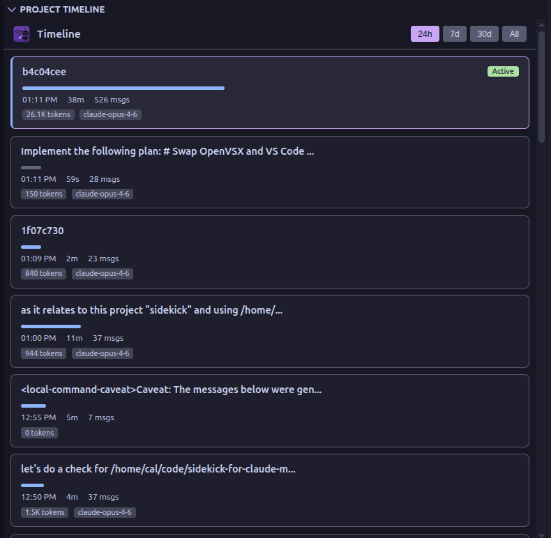

# Project Timeline

See every session your agent has run in the current project at a glance. The Project Timeline gives you a chronological overview of all sessions — how long they lasted, how many tokens they consumed, and what they accomplished — so you can track project momentum and spot patterns across sessions.

## What It Shows

Each session appears as a card with:

- **Session label** — the first prompt or session ID for quick identification
- **Duration bar** — visual bar proportional to session length, so you can immediately see which sessions were long-running
- **Time and duration** — when the session started and how long it ran
- **Message count** — total messages exchanged during the session
- **Token badge** — total tokens consumed (e.g., "25.5K tokens")
- **Task badge** — number of tasks created during the session
- **Error badge** — number of tool errors encountered
- **Model badge** — which model was used (e.g., "claude-opus-4-6")
- **Active indicator** — green "Active" badge on the currently running session

## Time Range Filtering

Filter sessions by time range using the controls at the top:

| Range | Shows |
|-------|-------|
| **24h** | Sessions from the last 24 hours |
| **7d** | Sessions from the last 7 days (default) |
| **30d** | Sessions from the last 30 days |
| **All** | Every session ever recorded for this project |

## Expandable Details

Click any session card to expand it and see:

- **Tool Breakdown** — which tools were used and how many times (e.g., Edit: 45 calls, Read: 32 calls, Bash: 18 calls)
- **Tasks** — tasks created during the session with their completion status
- **Errors** — error categories with counts and example messages

## Opening Past Sessions

Click the open button on any session card to load that session in the Session Analytics Dashboard, where you can explore it in full detail — activity timeline, token attribution, mind map, and more.

## How It Works

The timeline scans all session files for the current project directory and extracts lightweight metadata (timestamps, token totals, error counts, key files). Results are cached in memory and only re-parsed when a session file's modification time changes, so the view loads quickly even with hundreds of sessions.

## Accessing the Timeline

The Project Timeline panel appears in the **Agent Hub** sidebar, below the Kanban Board. It's visible whenever session monitoring is active.
