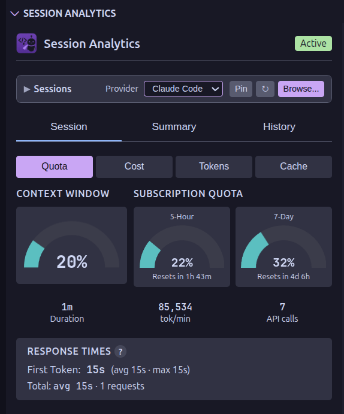
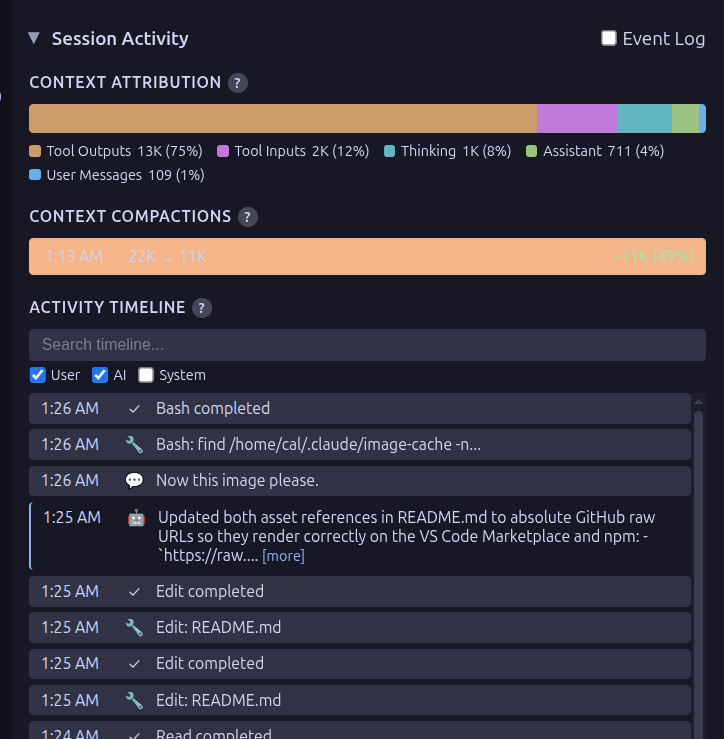
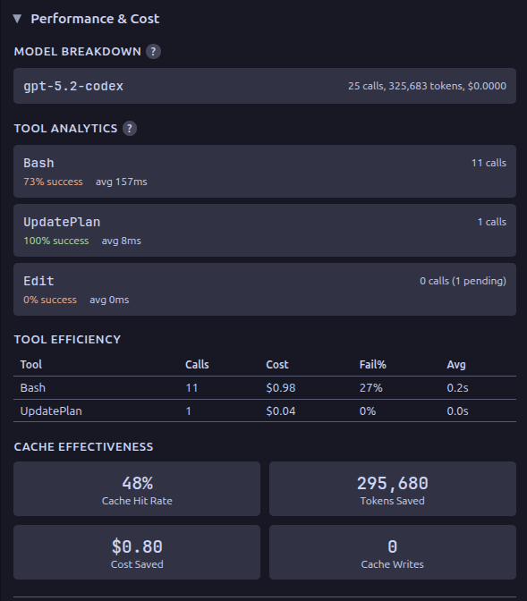
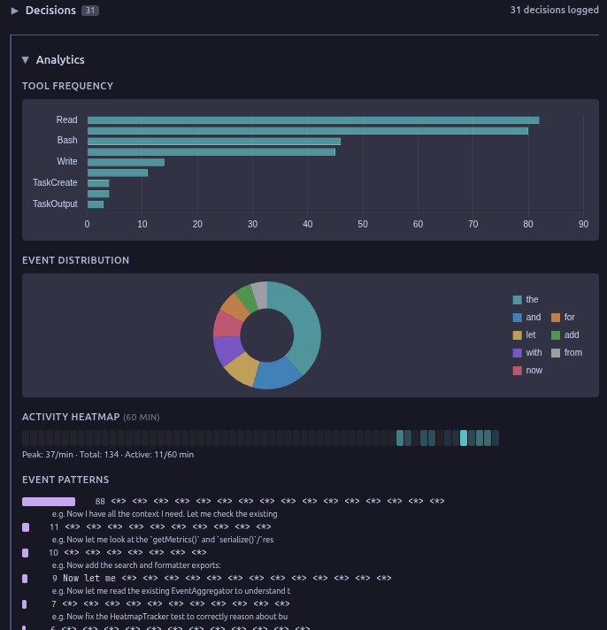
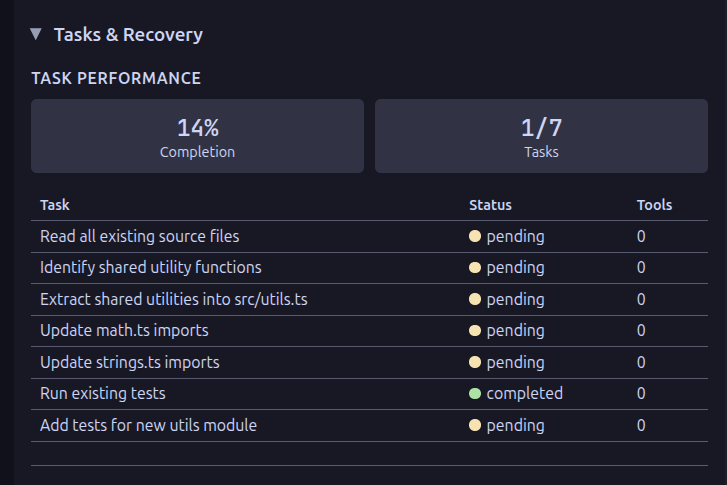
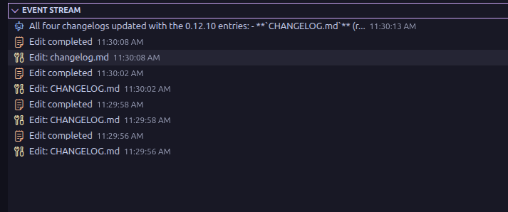
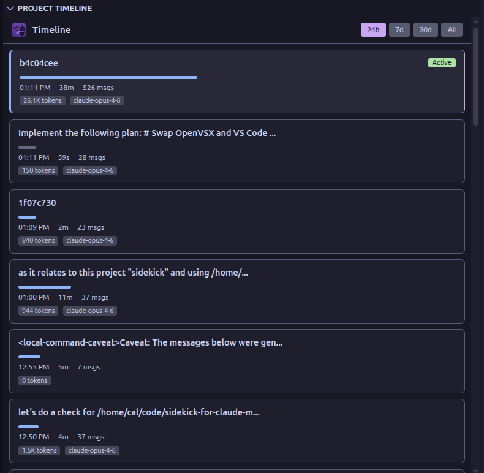
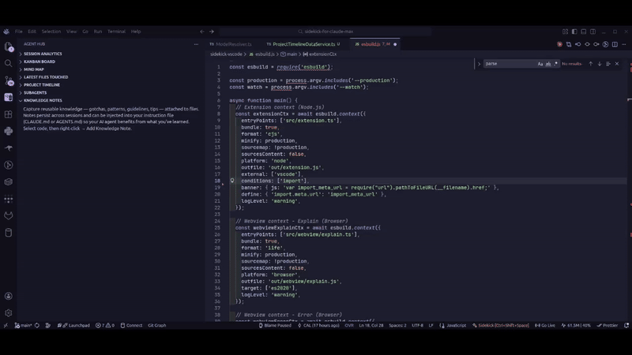

# Session Monitor

When your coding agent runs autonomously, you're flying blind — tokens burn silently, context fills up, and tool errors pile up without warning. The session monitor gives you a real-time dashboard so you can catch problems early and understand where your budget is going.

Monitor your coding agent sessions in real-time with a comprehensive analytics dashboard. Supports Claude Code, OpenCode, and Codex CLI.

## Accessing the Dashboard

Click the **Agent Hub** icon in the activity bar (left sidebar) to access all monitoring views. Session Analytics is expanded on first run; Mind Map, Kanban Board, Plans, Project Timeline, Latest Files Touched, Knowledge Notes, Subagents, and Event Stream start collapsed — click a section header to expand one, and VS Code remembers your layout from then on. With `sidekick.enableSessionMonitoring` set to `false`, those eight views are hidden entirely and Session Analytics shows a placeholder that can turn monitoring back on.

## Session Analytics Dashboard

The main dashboard panel provides:

- **Token Usage** — real-time input/output token tracking with model-specific pricing
- **Cost Tracking** — per-model cost breakdown with accurate pricing; unknown models render as `—` with a dashboard footer warning (hydrated on startup from LiteLLM, cached to `~/.config/sidekick/pricing-catalog.json`)
- **Context Token Attribution** — stacked bar chart showing where your context budget goes (system prompt, CLAUDE.md, user messages, assistant responses, tool I/O, thinking)
- **Token Usage Tooltips** — hover for quota projections and estimated time to exhaustion
- **Context Window Gauge** — input/output token usage vs. limits, with theme-aware colors that adapt to light, dark, and high-contrast themes. The window size comes from the LiteLLM catalog, or from the window your provider reports for itself when it offers one (Codex does), so it reflects your account tier rather than a published maximum
- **Compaction Detection** — timeline markers showing when context was compressed and how much was lost
- **Context Health** — real-time fidelity score showing how much context degradation has occurred from compactions, with a color-coded gauge (green/yellow/red)
- **Truncation Tracking** — detects when tool outputs are truncated by the agent, with per-tool breakdown and total count
- **Cycle Detection** — alerts when your agent enters repetitive loops (e.g., Read → Edit → Read → Edit on the same file)
- **Activity Timeline** — user prompts, tool calls, errors, and subagent spawns with full-text search
- **Timeline Search & Filtering** — filter by event type, noise classification (system reminders, sidechains)
- **Session Navigator** — collapsible panel to switch between active and recent sessions
- **Tool Analytics** — categorized tool usage with drill-down to individual calls
- **Toast Notifications** — dismissable feedback toasts (e.g. "Copied to clipboard") with `aria-live` for screen readers
- **Session Summary** — AI narrative generation with progress notification
- **Session Dump** — export the current session as text, markdown, JSON, or HTML via `Sidekick: Dump Session Report` (Command Palette, status bar menu, or Session Analytics toolbar)
- **HTML Session Report** — self-contained HTML report with full transcript, token/cost stats, model breakdown, and tool-use summary via `Sidekick: Generate HTML Report` (Command Palette or Session Analytics toolbar). Also available in the [CLI](cli.md#html-report) as `sidekick report` or by pressing `r` in the TUI dashboard

### Dashboard Sections

The dashboard organizes information into three collapsible groups:

- **Session Activity** — Activity Timeline, File Changes, Errors with categorized per-tool error forensics, and a compaction ledger summarizing tokens evicted and the estimated cost of re-establishing context (reported vs. heuristic source)
- **Performance & Cost** — Model Breakdown, Tool Analytics, Tool Efficiency, Cache Effectiveness, Advanced Burn Rate, code impact (cost per changed line, overall and per model), and a Session Quality score (beta) with trend and factor breakdown

- **Analytics** — Tool Frequency chart, Event Distribution doughnut, Activity Heatmap grid, and Event Patterns with template clustering

- **Tasks & Recovery** — Task Performance, Recovery Patterns

### History Tab

The History tab charts the persisted usage store (`historical-data.json`) over **Today** (hourly buckets), **This Week** and **This Month** (daily), and **All Time** (monthly), with drill-down from months to days and days to hours. Three controls shape the chart:

- **Metric** — tokens (cache-inclusive), cost, or messages.
- **Series** — _Total_, _By model_ (stacked bars per model from the daily and monthly records), or _By tool_ (stacked tool calls; the metric select is disabled because tools carry no token attribution). Hourly buckets record no breakdown, so _Today_ shows totals.
- **Project** — filter to one workspace. Filtered views aggregate the durable per-session records, which are capped at the last 500 sessions.

A dashed line overlays the previous period (yesterday, the seven days before, or the previous calendar month), and the summary tiles show the change versus it.

### Health Tab

The Health tab runs the same checks as **Sidekick: Doctor** (which now also focuses this tab) and shows them in place:

- a status banner (healthy, attention, unhealthy) with the number of items needing attention;
- the check list — project slug, session discovery, OpenCode sqlite, accounts, provider API status, deprecated settings — each with a repair hint when there is one;
- **Session Providers** — diagnostics the Claude Code, Codex, and OpenCode providers emit when probed for the current workspace (missing directories, an unavailable `sqlite3`, enumeration failures);
- **Failing Tools** — the tools with the most failures over the last 7 and 30 days, with a trend arrow comparing the week to the 30-day weekly average (the same rule `sidekick stats` prints).

Press **Refresh** to run the checks again.

## HTML Session Report

Generate a self-contained HTML report for any session — full transcript with collapsible thinking blocks and tool detail, token/cost stats, model breakdown, and tool-use summary. The output file has zero external dependencies and can be shared or archived as a single `.html` file.

- **VS Code**: Run `Sidekick: Generate HTML Report` from the Command Palette or the Session Analytics toolbar. The report opens in a webview panel. Also available as the "HTML Report" format option in `Sidekick: Dump Session Report`.
- **CLI**: Run `sidekick report` to generate and open in the default browser, or press `r` in the TUI dashboard. See the [CLI HTML Report docs](cli.md#html-report) for flags and examples.

## Subagent Tree

The subagent tree view displays spawned subagents in a hierarchical parent/child structure. When an agent spawns other agents, they appear as nested children in the tree, with collapsible nodes showing the agent count. The tree uses trace-based parsing from session logs to reconstruct the spawn hierarchy, falling back to a flat list for providers that use different directory structures. Running agents are tracked in real-time and merged into the tree as they complete.

## Event Stream

A sidebar tree view showing live session events as they happen. Each event displays a color-coded icon by type (user prompt, assistant response, tool use, tool result), a summary, and a timestamp. The view maintains a ring buffer of the 200 most recent events and updates in real-time as your agent works.

## Session Intelligence

Three detection systems run continuously during a session to surface problems that are otherwise invisible.

### Context Health

As your agent's context window fills up, the runtime compresses (compacts) the conversation to make room. Each compaction loses information. The context health gauge tracks this degradation as a percentage — starting at 100% and dropping with each compaction event.

- **Green (70-100%)** — context is mostly intact, decisions and earlier work are reliable
- **Yellow (40-69%)** — noticeable degradation, earlier decisions may have been lost
- **Red (below 40%)** — significant information loss, consider starting a fresh session

The gauge appears in the dashboard's Session Activity section. If context health drops below 50%, session handoffs automatically include a warning so the next session knows to re-verify earlier decisions.

### Truncation Detection

When tool outputs exceed size limits, the agent runtime silently truncates them — your agent sees partial results but keeps going as if nothing happened. Sidekick scans every tool result for truncation markers and tracks which tools are affected.

The dashboard shows the total truncation count and a per-tool breakdown. Files that produce repeated truncated output are automatically surfaced as knowledge note candidates, since they likely contain gotchas worth capturing.

### Cycle Detection

Sometimes agents get stuck in loops — reading a file, editing it, reading it again, editing it again — burning tokens without making progress. Sidekick uses a sliding-window algorithm to detect repeating patterns of tool calls.

When a cycle is detected, a VS Code notification fires with the affected files so you can intervene. The mind map also highlights cycling files with a distinct visual indicator.

## Provider Status

The dashboard polls API health for both Claude (status.claude.com) and OpenAI (status.openai.com), then shows the banner only for the monitored provider. When the relevant API is degraded or experiencing an outage, a banner appears in the gauge row showing:

- Color-coded indicator (yellow for minor, red for major/critical)
- Affected components and their status
- Active incident name with link to the status page

The relevant status page is shown based on the monitored provider — Claude status for Claude Code, OpenAI status for Codex, and no provider-status banner for OpenCode. The banner is hidden when all systems are operational. Polls every 60 seconds, pausing when the dashboard is not visible. Also available as a standalone CLI command: `sidekick status`, which checks both endpoints directly.

## Historical Import

On first activation with an empty history store, the extension imports every finished session it can find — Claude Code, Codex, and OpenCode — through the shared importer that `sidekick import` also uses, with a status-bar spinner and no toast. Run **Sidekick: Import Historical Data** to import again later; files already imported, sessions the live monitor persisted, and files modified in the last minute are skipped, so re-running never double counts.

## Quota & Rate Limits Display

The dashboard shows quota or rate-limit data depending on the active provider:

- **Claude Max** ("Subscription Quota"): 5-hour and 7-day utilization from the Anthropic OAuth usage API, with color-coded gauges, elapsed-time projections (e.g., `40% → 100%`), countdown timers, and auto-refresh every 5 minutes.
- **Codex** ("Rate Limits"): Primary and secondary rate-limit windows extracted from token_count events in the Codex event stream. Data arrives automatically during active sessions — no separate polling needed. When the tile refreshes from Codex's API, it also lists available **reset credits** (rate-limit reset grants) and their expirations.
- **OpenCode**: No quota display — OpenCode does not provide rate-limit data.

Beneath the quota gauges, a **Billing block** card shows the five-hour block that is open right now, computed from session logs the way `sidekick blocks` does: the block window, elapsed and remaining time, cache-inclusive tokens, cost, burn rate, and the projected end-of-block tokens and cost. It is labelled a local estimate; when `sidekick statusline` has persisted an official Claude Code rate-limit sample, the card shows it beneath the estimate for comparison. The card recomputes at most once a minute while the view is visible.

When quota cannot be fetched, the dashboard keeps the section visible and shows a structured unavailable state for missing credentials, expired sign-in, rate limits, network/server failures, or unexpected API responses. Quota failure transitions appear as lightweight dashboard toasts and are recorded in notification history, without triggering native VS Code popup notifications.

## Project Timeline

See every session your agent has run in the current project at a glance. Each session appears as a card showing its label, duration, token usage, task and error counts, and which model was used. Filter by time range (24h, 7d, 30d, or all) and click any card to expand tool breakdowns, task lists, and error summaries. See the [Project Timeline](project-timeline.md) page for full details.

## Knowledge Notes

Capture reusable knowledge — gotchas, patterns, guidelines, and tips — attached to specific files in your codebase. Notes appear as gutter icons in the editor and in a dedicated tree view. Right-click notes to edit, confirm, or delete them. Use "Inject Knowledge Notes" to append them to your instruction file so your agent benefits from what you've learned. See the [Knowledge Notes](knowledge-notes.md) page for full details.

## Session Discovery

The monitor automatically discovers sessions based on your configured provider. If the session is in a different directory:

- Use **"Sidekick: Browse Session Folders..."** to manually select a session folder
- Selection persists across VS Code restarts
- **"Sidekick: Reset to Auto-Detect Session"** clears manual selection

## When no session is visible

The dashboard distinguishes an empty session list, an unavailable provider, and paused monitoring. It shows the selected provider, workspace, and session location so you can check where Sidekick is looking.

- **Refresh** retries discovery and updates the session list.
- **Browse** lets you select an existing session folder.
- **Run Doctor** opens diagnostics for the selected session provider.
- **Resume** restarts paused monitoring, preserving your provider and custom folder. Refreshing the list while paused keeps monitoring paused.

Use **Sidekick: Stop Session Monitoring** to pause and **Sidekick: Start Session Monitoring** to resume. Views continue updating after resume without a window reload.

## Configuration

| Setting                            | Default | Description                                                        |
| ---------------------------------- | ------- | ------------------------------------------------------------------ |
| `sidekick.enableSessionMonitoring` | `true`  | Enable/disable session monitoring (requires a window reload)       |
| `sidekick.sessionProvider`         | `auto`  | Which agent to monitor: `auto`, `claude-code`, `opencode`, `codex` |

## Accessibility

In the dashboard, use **Left/Right Arrow**, **Home**, and **End** to move between tabs. Session cards and section headings are buttons: use **Tab** to reach them and **Enter** or **Space** to activate them. Collapsed content is removed from keyboard navigation, and session-list updates preserve focus on the same session when it is still available.

All webview panels include:

- `prefers-reduced-motion` support — animations and transitions disabled when the OS-level setting is enabled
- Focus-visible outlines (2px) on all interactive elements for keyboard navigation
- Custom scrollbar styling (6px, themed) and text selection colors matching the VS Code editor
- Responsive layout adjustments for narrow sidebar panels (under 260px)
- Card entrance animations with stagger delay in Task Board, Plan Board, and Project Timeline (respects reduced motion)
