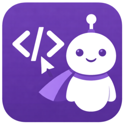

# Sidekick Agent Hub

  

**Multi-provider AI coding assistant for VS Code** — inline completions, code transforms, commit messages, and agent session monitoring.

## Supported Providers

| Provider | Inference | Session Monitoring | Cost |
|----------|-----------|-------------------|------|
| **Claude Max** | :white_check_mark: | :white_check_mark: | Included in subscription |
| **Claude API** | :white_check_mark: | :x: | Per-token billing |
| **OpenCode** | :white_check_mark: | :white_check_mark: | Depends on configured provider |
| **Codex CLI** | :white_check_mark: | :white_check_mark: | OpenAI API billing |

## Feature Highlights

- **Inline Completions** — intelligent code suggestions as you type
- **Code Transforms** — select code, describe changes in natural language
- **AI Commit Messages** — generate commit messages from staged changes
- **Session Monitor** — real-time dashboard with token usage, costs, and activity timeline
- **Mind Map** — interactive graph of session structure and file relationships
- **Kanban Board** — track tasks and subagent activity
- **Quick Ask** — inline chat for questions and code changes
- **Code Review** — AI pre-commit review with inline annotations
- **PR Descriptions** — auto-generate pull request descriptions
- **Error Analysis** — AI-powered error explanations and fixes
- **Session Handoff** — context continuity between sessions
- **CLAUDE.md Suggestions** — learn from session patterns

## Quick Install

Install from the [VS Code Marketplace](https://marketplace.visualstudio.com/items?itemName=CesarAndresLopez.sidekick-for-max) or [Open VSX](https://open-vsx.org/extension/cesarandreslopez/sidekick-for-max).

Then see [Getting Started](getting-started/installation.md) for provider setup.

## Contributing

Contributions welcome! See the [Contributing Guide](contributing.md).

## License

MIT
